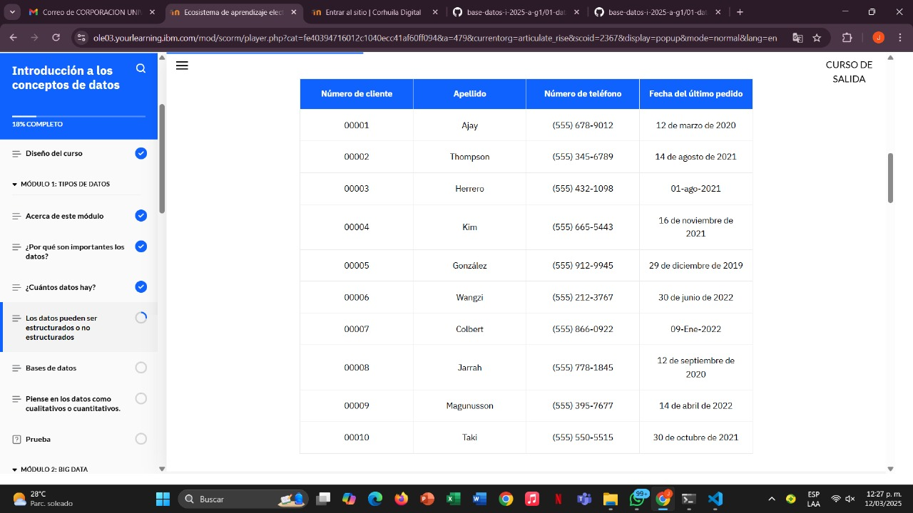
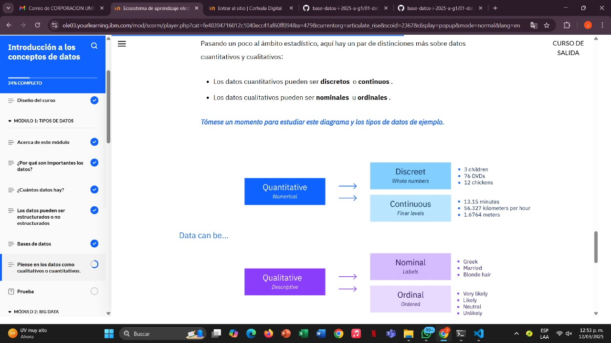

# Learning - Introduction to Data Concepts
***

## concepts

# Objetivos de aprendizaje

1. Explicar la importancia de los datos en un mundo digital
2. Diferenciar entre datos estructurados y no estructurados
3. Identificar el proposito de una base de datos
4. Diferenciar entre datos cuantitativos y cualitativos

## Importancia de los Datos

 ## Datos que se crean en la vida diaria

 

 - Ademas de eso, lo se pueden clasificar como estructurados o no estructurados

 # Datos estructurados

 - Los datos estructurados son información que se puede organizar en filas y columnas. Quizás hayas visto datos estructurados en una hoja de cálculo, como Google Sheets o Microsoft Excel. Para información compleja, los analistas de datos utilizan herramientas como el lenguaje de consulta estructurado (SQL), que puede ordenar grandes cantidades de datos almacenados en muchas tablas conectadas. Si puedes organizar la información dentro de los datos en grupos, en función de características específicas, entonces esos grupos son datos estructurados.

 ## Ejemplo de datos estructurados

 

 # Datos no estructurados

 - Los datos no estructurados hacen referencia a “todo lo demás”. No tienen un formato predefinido. No tienen ninguna organización o estructura incorporada. Son una conglomeración de diversos tipos de datos que se almacenan en sus formatos originales.  

 ## Ejemplo de datos no estructurados

 

 # Bases de datos

 - Una base de datos es una colección organizada de datos estructurados en un sistema informático. Piense en una base de datos como un contenedor o repositorio con numerosas columnas y filas. Una base de datos mantiene los datos altamente organizados, de modo que sean fácilmente accesibles mediante consultas y software de cálculo.

 # ¿Bases de datos relacionales?

 - Estas bases de datos son colecciones de múltiples conjuntos de datos o tablas que se vinculan entre sí. Por ejemplo, una tabla podría incluir nombres y direcciones, mientras que otra podría incluir propiedades y sus propietarios. Si algunos de los propietarios también aparecen en la tabla de nombres y direcciones, ambas tablas se pueden vincular, creando así una base de datos relacional.

# Datos cuantitativos o cualitativos 

## Ejemplo de datos cuantitativos

- Cuantitativo:  significa que algo es numérico y se puede contar. Piensa en cantidad  : algo que se puede contar (o medir).

## Discreto
- Los datos discretos incluyen números enteros o números naturales que no se pueden dividir, como el número 1 o el 9.
Por ejemplo, el número de habitaciones de una casa o el número de personas en un cine son datos discretos porque solo se pueden contar individuos enteros. No se pueden contar 1,7 personas.

## Continuo

- Los datos continuos pueden dividirse en niveles más finos y tomar cualquier valor. (Es lo opuesto a los datos discretos). Los datos continuos pueden dividirse en muchos decimales. Se pueden medir en una escala o continuo.

## Ejemplo: 
- Existe una cantidad infinita de valores posibles para datos continuos. Por ejemplo:

- El peso de un automóvil se puede calcular con muchos decimales.
- La altura, el peso y la longitud son formas de datos continuos.
- Algunos datos continuos pueden cambiar con el tiempo, como la velocidad de un avión o la temperatura de una habitación.

## Ejemplo de datos cualitativos

- Cualitativo: significa algo que no es numérico y no se puede contar. Piensa en la calidad  : algo que se puede categorizar sobre los datos.

## Nominal

- Nominal proviene del latín y significa "nombre". Es un nombre o etiqueta para datos, como: "Mi amiga es italiana. Se llama María. Tiene ojos marrones".
Los datos nominales etiquetan variables sin valor cuantitativo (o numérico). Pueden agruparse en categorías, pero carecen de un orden o jerarquía definidos.

## Ejemplo 

- Por ejemplo, los tipos de datos nominales incluyen:

* Color de cabello, como rubio, negro o castaño.
* Religión, como la cristiana o la budista.
* Estado civil, como soltero, casado o viudo.
* Etnicidad, como asiática o hispana

## Ordinal 

- El término ordinal se refiere al orden de las variables. Los datos ordinales se ordenan según su posición en una escala.

## Ejemplo

* Las calificaciones de letras escolares (como A, B y C), los tamaños (como pequeño, mediano y grande) y los niveles de encuesta de satisfacción del cliente (como satisfecho, neutral e insatisfecho) son escalas ordinales .

* En la recopilación de datos y la investigación, las escalas ordinales se utilizan comúnmente para medir percepciones y opiniones (por ejemplo, "¿Qué probabilidad hay de que usted recomiende…?").

# Tambien puede ser: 

# Finalizacion modulo 1:

