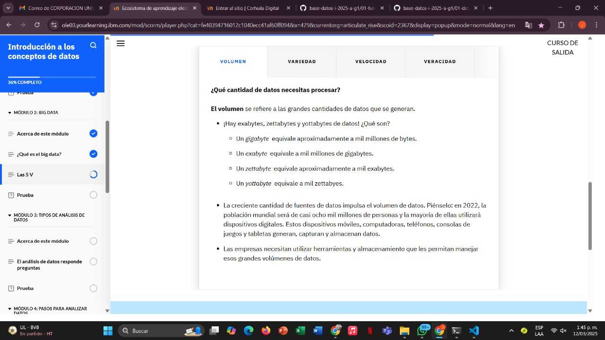

# Learning - Introduction to Big Data
***

## Concepts

# Objetivos de aprendizaje

1. Describe las 5 V del big data

# ¿Que es el Big Data?

- El término “big data” existe desde hace años, pero no existe una definición oficial y universal de big data.

# ¿Que son las 5V?

- Los elementos del big data se pueden explicar mediante cinco características generales llamadas las 5 V. Las 5 V son Volumen , Variedad , Velocidad , Veracidad y Valor .  Las 5 V ayudan a los científicos de datos a comprender con qué están trabajando y se representan en este diagrama.

# Ejemplo:

# Volumen

# Variedad

# Velocidad

# Veracidad

# Valor

# Finalizacion modulo 2

***