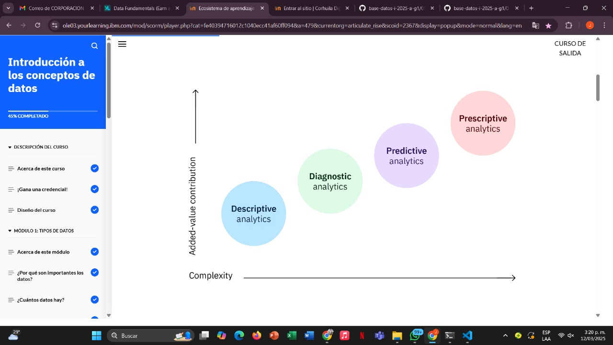
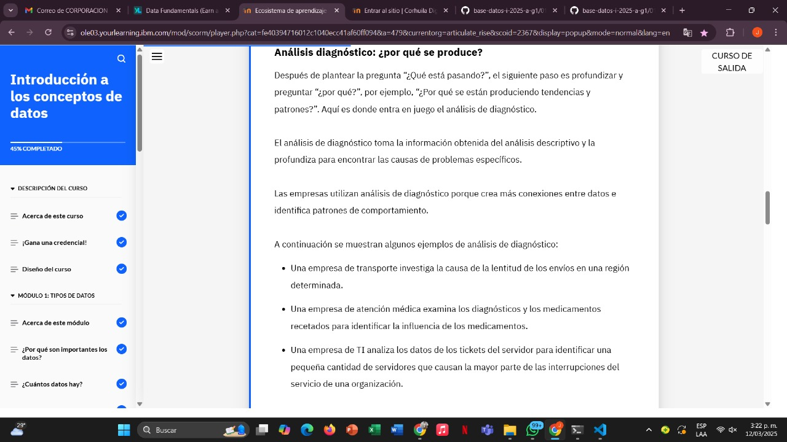
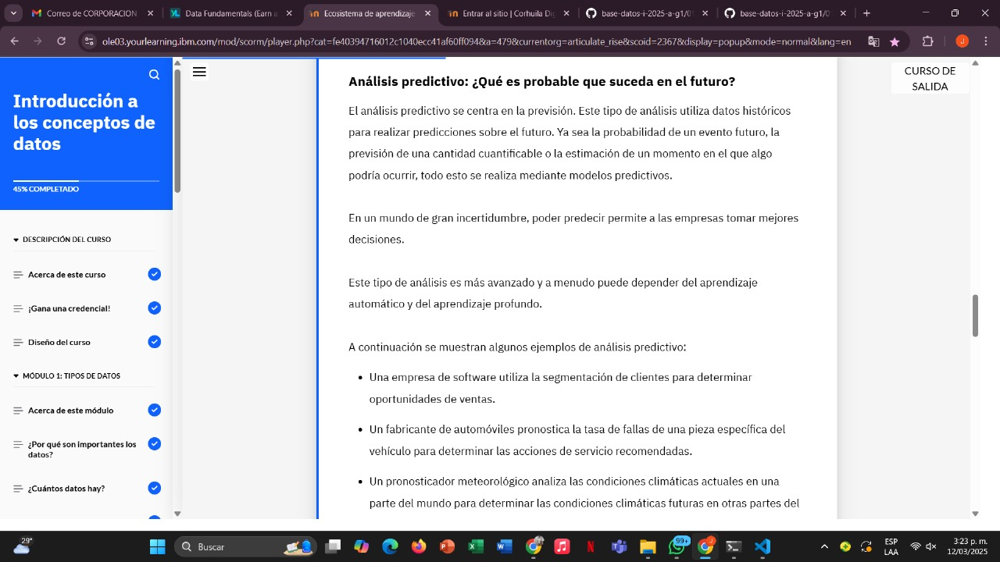
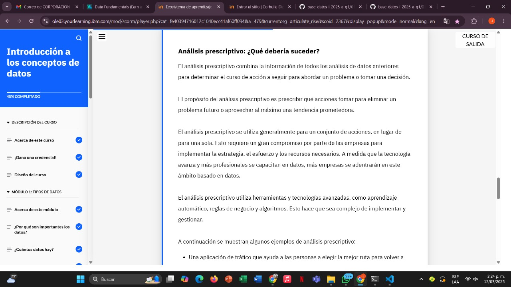

# Learning - Introduction to Tipo de Analisis de Datos
***

## Concepts

# Objetivos de aprendizaje

1. Describe los cuatro tipos de análisis de datos.

# ¿Ques es el analisis de datos?

- En un entorno empresarial en constante cambio, puede ser difícil predecir el siguiente paso. Ahí es donde entra en juego el análisis de datos. Una iniciativa exitosa de análisis de datos puede brindar una visión clara de dónde se encuentra, dónde ha estado y hacia dónde debe dirigirse.

- Tambien se puede conocer como TI, existen distintos tipos de analisis

1. Análisis descriptivo
2. Análisis de diagnóstico
3. Análisis predictivo
4. Analítica prescriptiva

## Analisis descriptivo

## Analisis Diagnostico

## Analisis predictivo

## Analisis prescriptivo

## Finzalizacion modulo 3

***