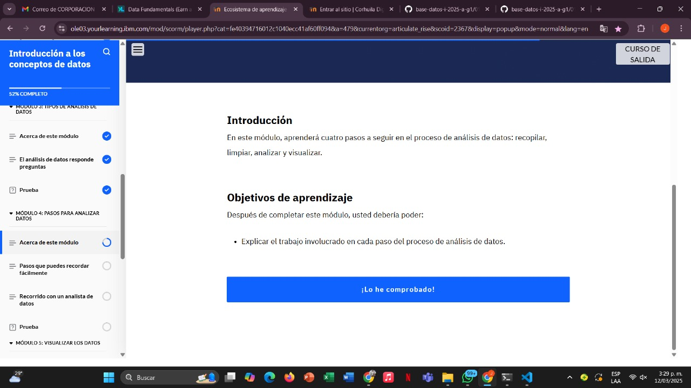
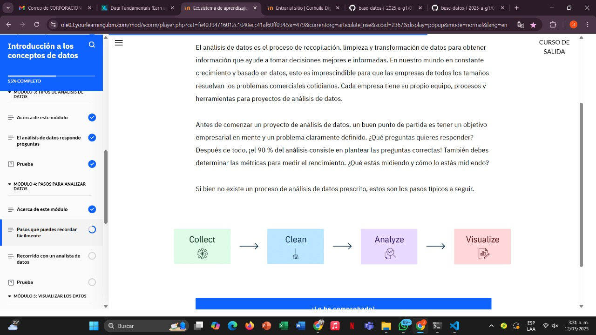
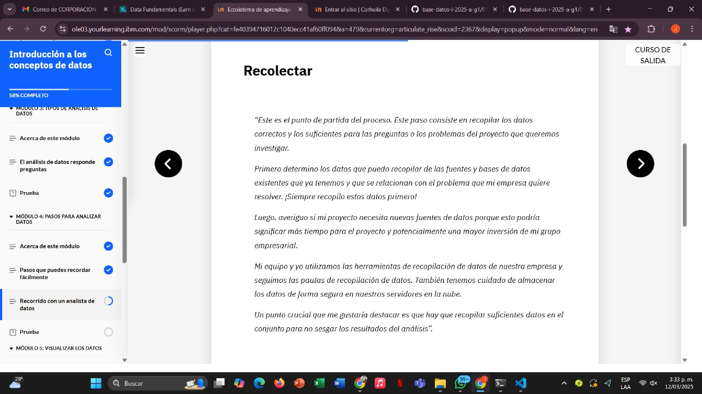
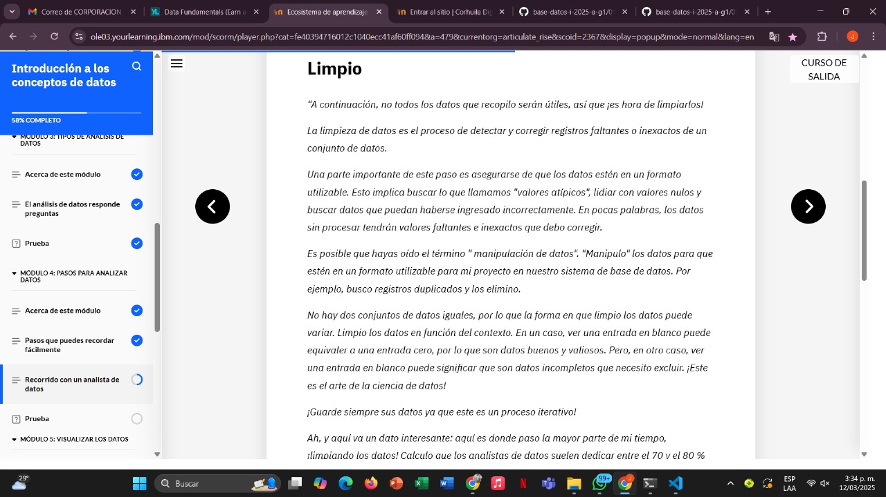
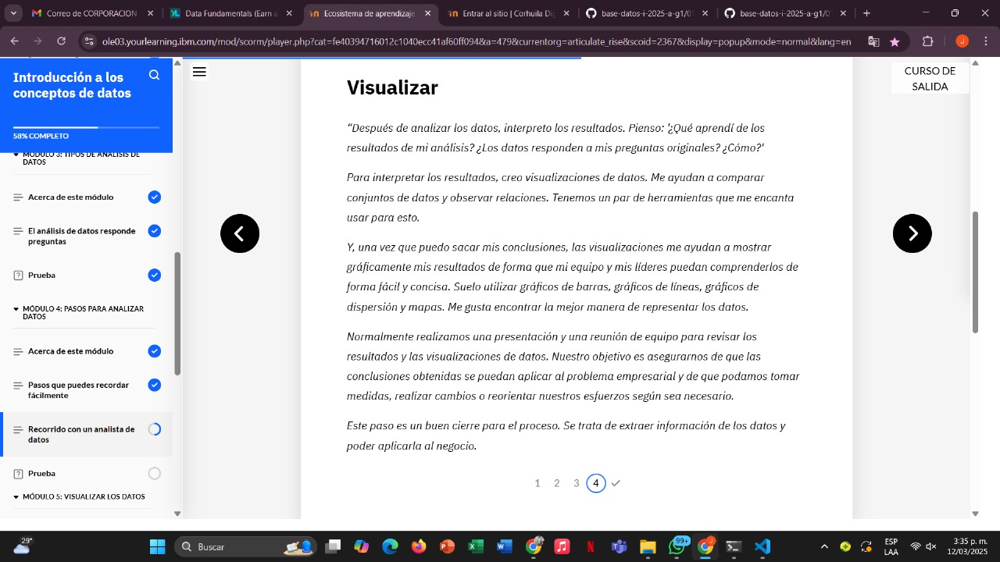
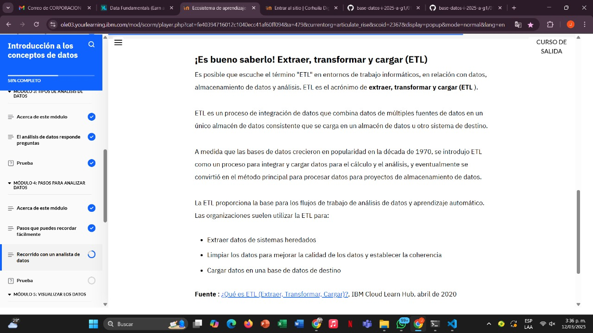
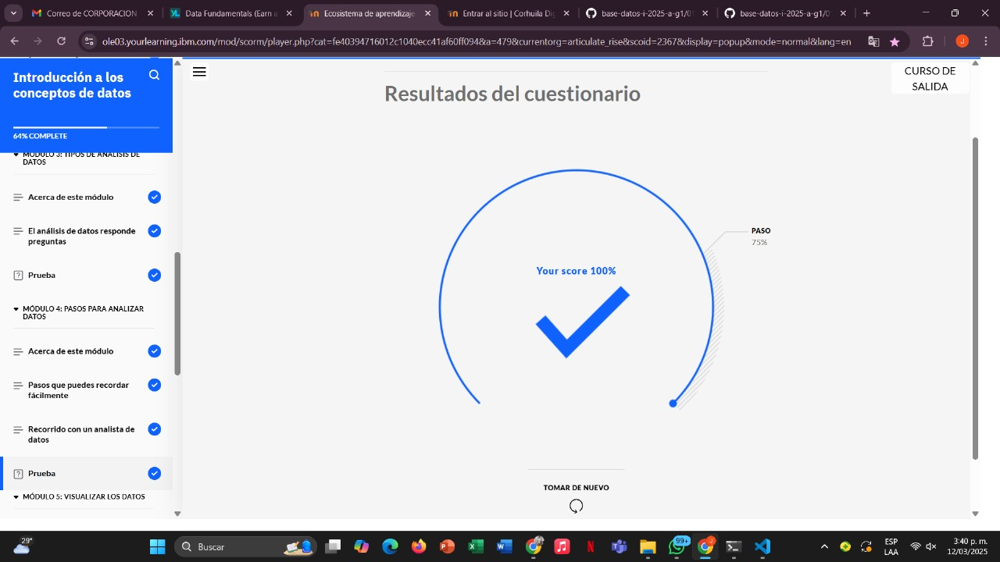

# Learning - Introduction to Analizar Datos
***

## Concepts

# Objetivos de aprendizaje

1. Explicar el trabajo involucrado en cada paso del proceso de análisis de datos.

## ¿Que es?

- El análisis de datos es el proceso de recopilación, limpieza y transformación de datos para obtener información que ayude a tomar decisiones mejores e informadas

## Recorrido con un analista de datos

- Conozca a Charles Ito . Trabaja en su empresa de investigación de marketing actual desde hace poco más de dos años. Charles estará encantado de guiarlo a través de lo que hace en un proyecto típico de datos de marketing para ayudarlo a comprender los pasos del análisis de datos.

Existen 4 pasos 
- Recolectar
- Limpio
- Analizar 
- Visualizar

## Paso 1: Recolectar datos

## Paso 2: Limpieza de datos

## Paso 3: Analizar datos

## Paso 4: Visualizar datos

- Es bueno extraer, transformar y cargar 

## Finalizacion modulo 4
