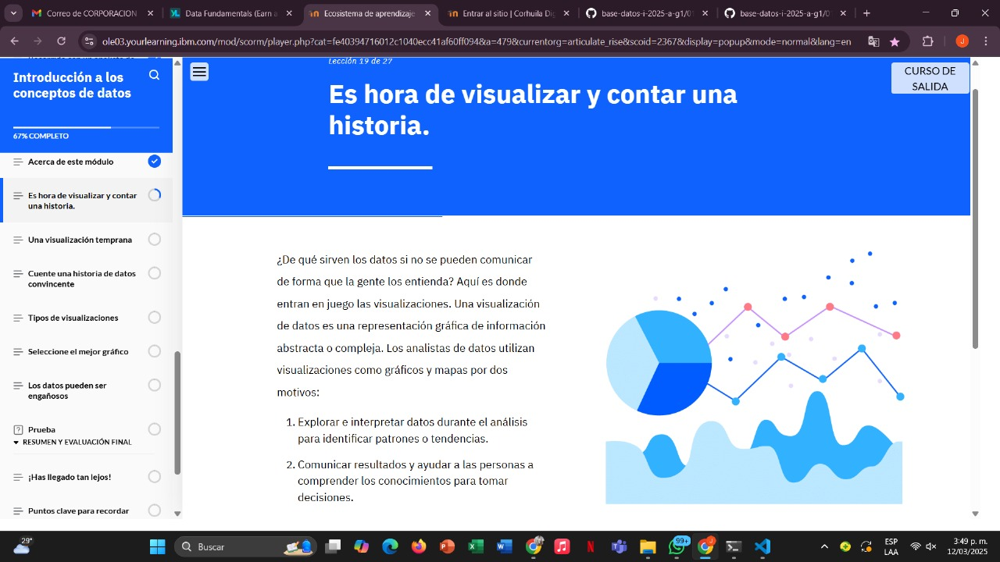
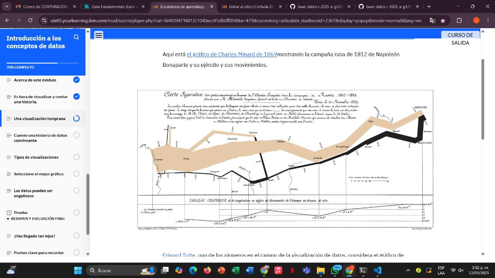
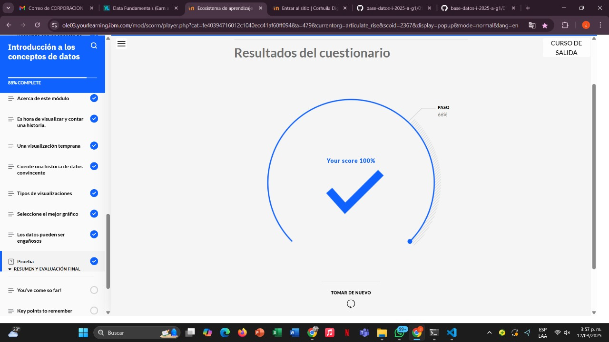

# Learning - Introduction to Visualizar Datos
***

## Concepts

# Objetivos de aprendizaje

1. Identificar el propósito de una visualización de datos
2. Reconocer diferentes gráficos para mostrar visualizaciones de datos de la mejor manera

## ¿Para que sirve?

- Aquí es donde entran en juego las visualizaciones. Una visualización de datos es una representación gráfica de información abstracta o compleja

## Ejemplo

## Finalizacion modulo 5 

