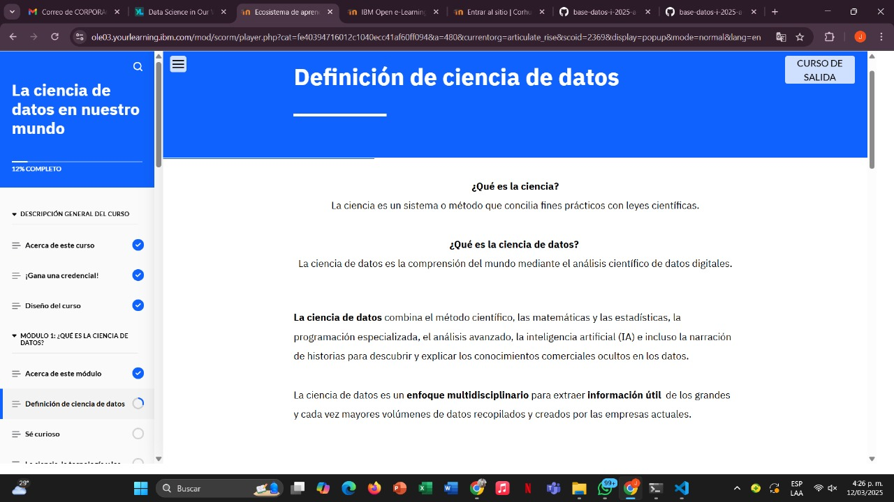
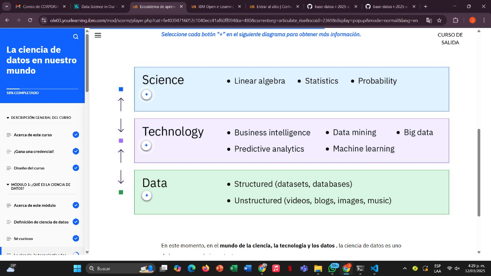
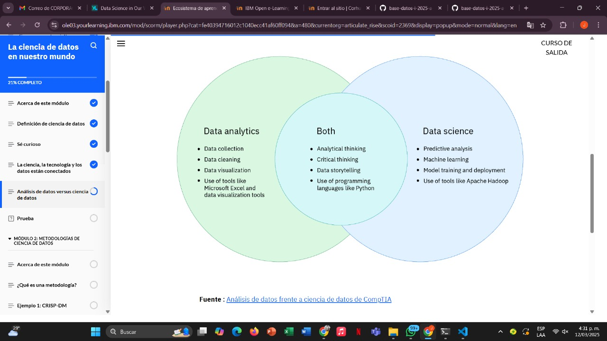

# Learning - Data Science
***

## Concepts

- En este módulo, aprenderás a explicar qué es la ciencia de datos. También aprenderás sobre la técnica de los 5 porqués y cómo usarla para identificar la causa raíz de un problema. Finalmente, descubrirás las similitudes y diferencias entre el análisis de datos y la ciencia de datos.

# Objetivos de aprendizaje

1. Definir ciencia de datos
2. Reconocer la importancia de ser curioso para resolver problemas con datos
3. Diferenciar entre los campos de análisis de datos y ciencia de datos.

## ¿Que es la ciencia de datos?

## Los 5 POR QUÉ

- Al analizar datos, encontrará un problema y deberá comprender por qué. Los 5 porqués(se abre en una nueva pestaña)Es una técnica valiosa para la resolución de problemas, fácil de recordar. Puedes determinar la causa raíz de un problema preguntándote "¿Por qué?" cinco veces . 

- Primero, pregunta "¿Por qué?", ​​obtén una respuesta y luego haz otra pregunta "¿Por qué?". ¡Y así sucesivamente! Cada respuesta te servirá de base para la siguiente pregunta "¿Por qué?". La respuesta a la quinta pregunta debería revelar la raíz del problema.

- Algunos problemas tienen más de una causa raíz. Si se desea descubrir varias causas raíz, es necesario repetir el método, formulando una secuencia de preguntas diferente cada vez.

## La ciencia de datas y la tecnologia estan conectados 

 

## Análisis de datos vs Ciencia de datos

- La principal diferencia entre el análisis de datos y la ciencia de datos radica en lo que los analistas y los científicos de datos hacen  con los datos, es decir, las tácticas que utilizan. A continuación, se explica cómo se diferencian:

* Los analistas de datos recopilan y examinan grandes conjuntos de datos para identificar tendencias, pronósticos y visualizaciones de datos con el fin de contar una historia convincente a través de información procesable. Esta información ayuda a las empresas a tomar decisiones informadas sobre sus necesidades comerciales.

* Los científicos de datos  diseñan y crean nuevos procesos para el modelado de datos. Utilizan algoritmos, análisis predictivos y análisis estadístico. Los científicos de datos tienen habilidades técnicas para organizar datos no estructurados y crear sus propias metodologías para hacer predicciones basadas en tendencias de datos.

## Finalizacion modulo 1

***