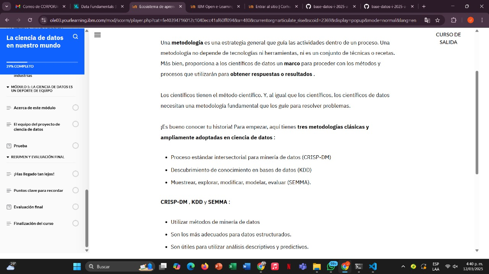
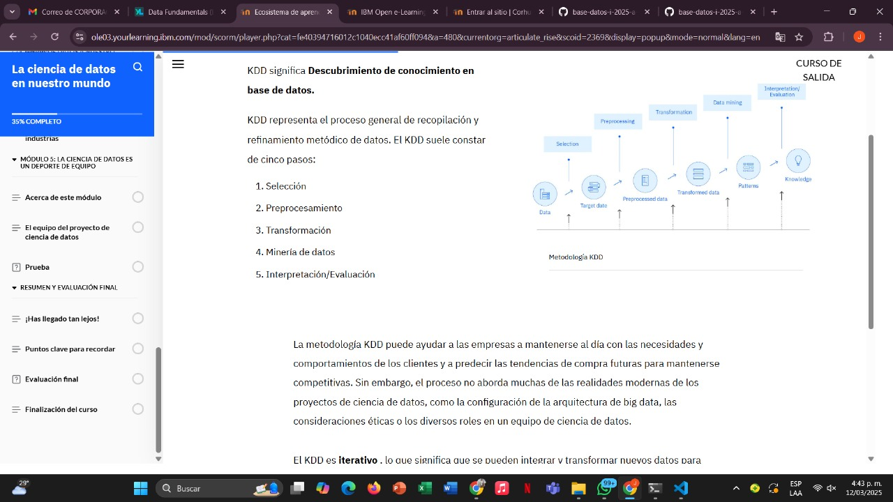
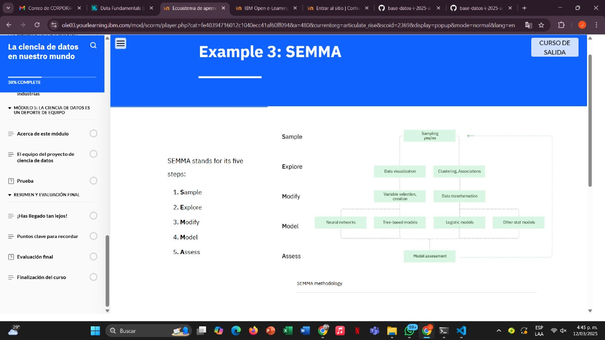
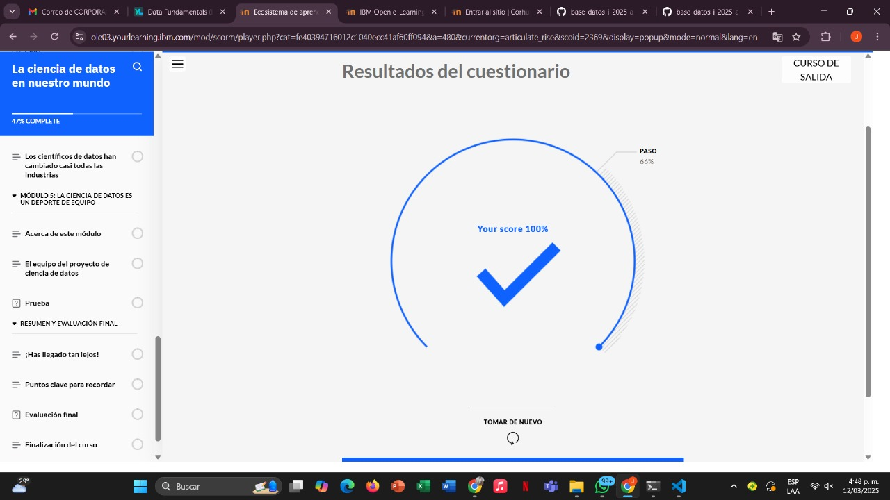

# Learning - Data Science
***

## Concepts
- En este módulo, aprenderá sobre tres metodologías tradicionales de ciencia de datos para que tenga una base para aprender más sobre proyectos de ciencia de datos

# Objetivos de aprendizaje

1. Identificar tres metodologías de ciencia de datos ampliamente adoptadas

# ¿Que es una metodologia?

* Nota : Estas metodologías no son útiles en proyectos que trabajan con datos no estructurados, como imágenes y texto. 

## Ejemplo 1 : CRISP-DM

* CRISP-DM consta de seis fases con flechas que indican las dependencias más importantes y frecuentes entre fases:

1. Comprensión empresarial
2. Comprensión de datos
3. Preparación de datos
4. Modelado
5. Evaluación
6. Despliegue
* La secuencia de las fases no es estricta. CRISP-DM es iterativo , lo que significa que las fases pueden repetirse para mejorar el resultado gradualmente. Los resultados de algunas etapas podrían requerir que el ciclo del proyecto se remonte a etapas anteriores.

## Ejemplo 2: KDD

## Ejemplo 3: SEMMA

## Finalizacion Modulo 2

