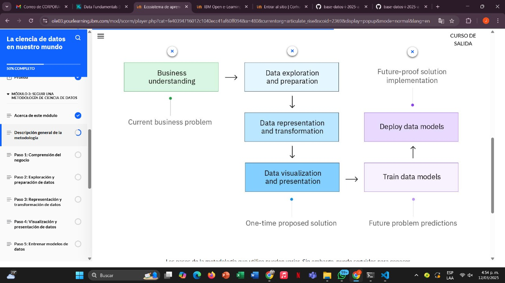
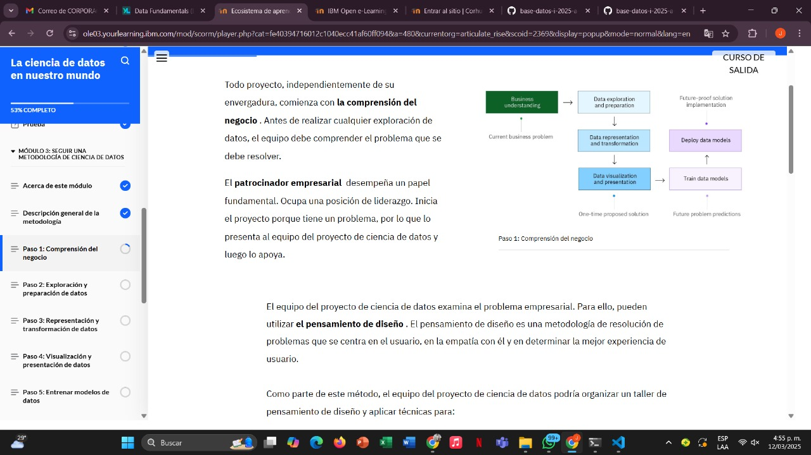
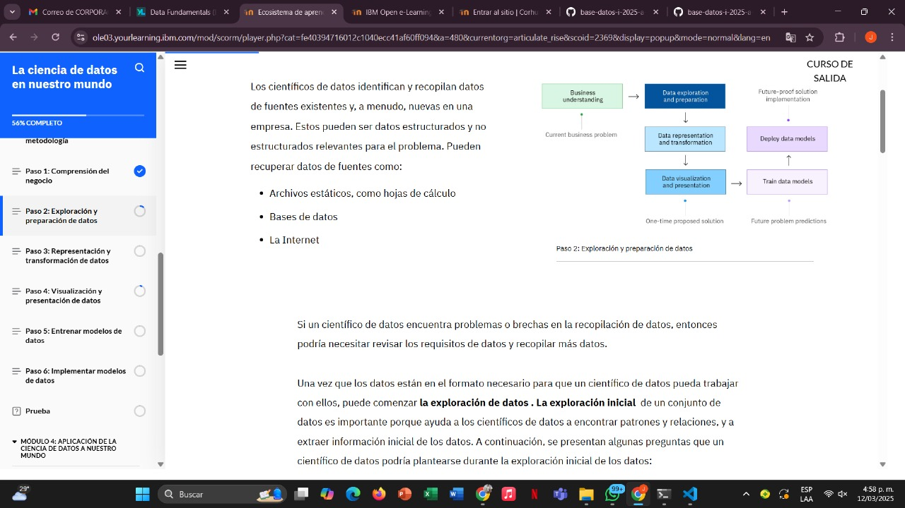
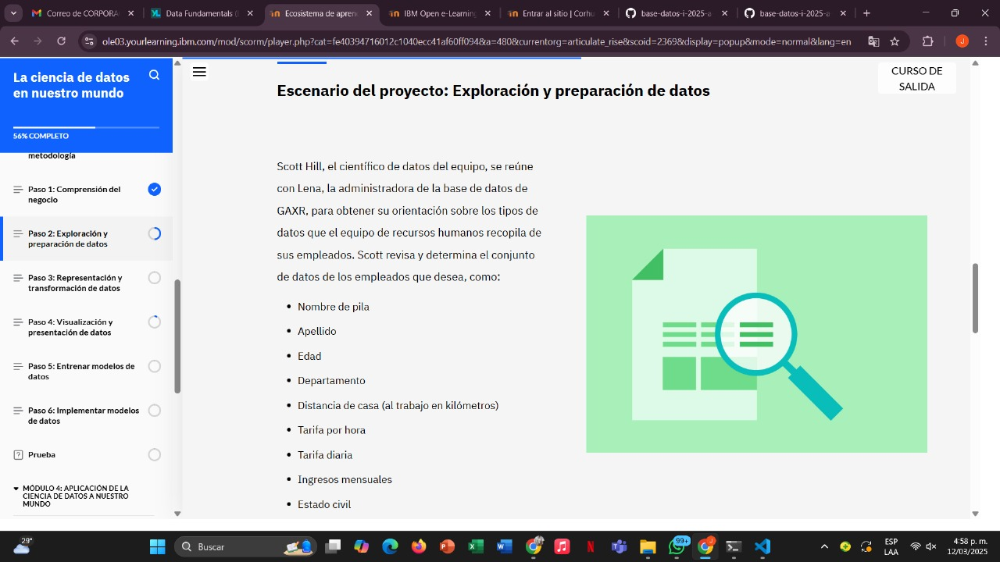
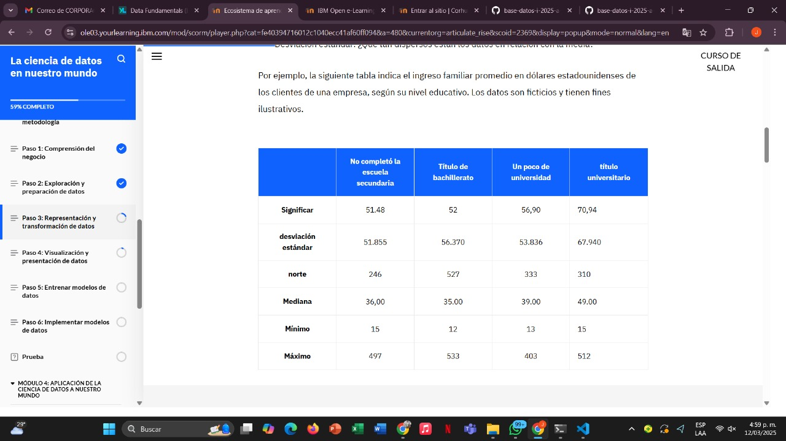
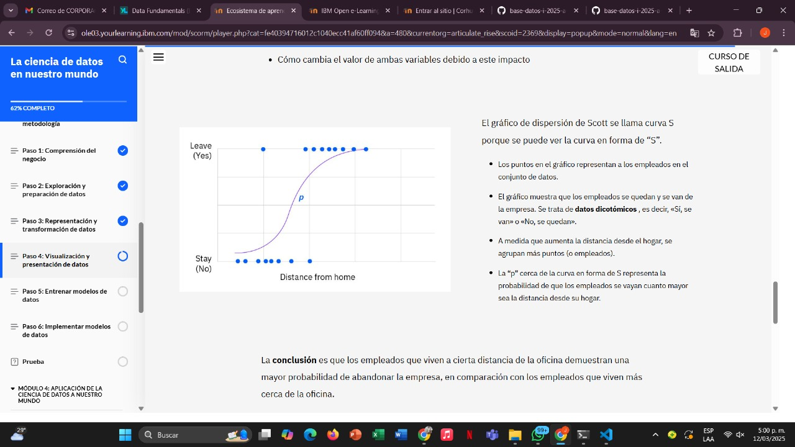
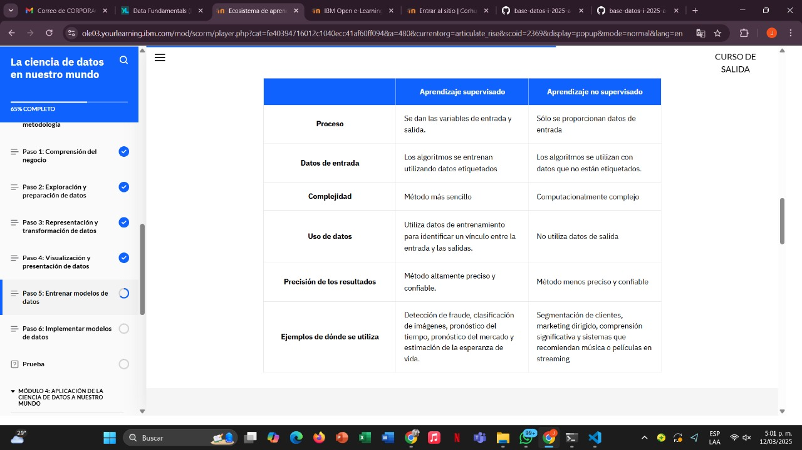
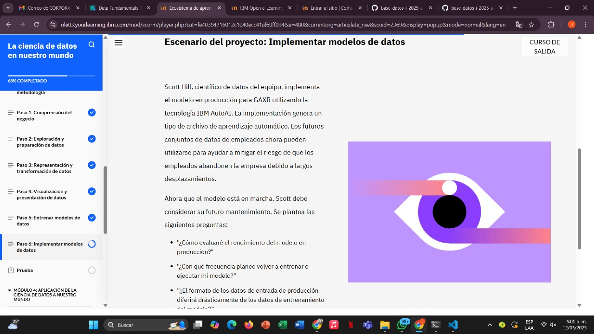
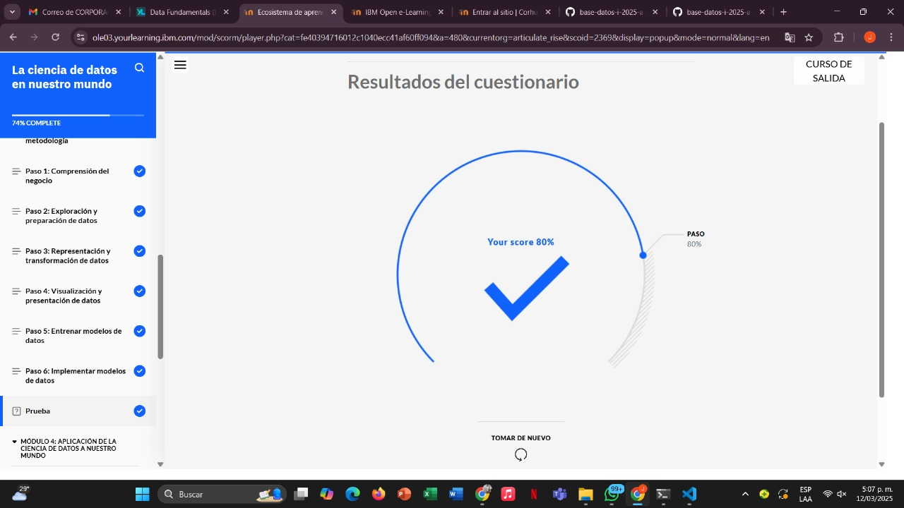

# Learning - Data Science
***

## Concepts

-En este módulo, aprenderá sobre las tareas típicas en una metodología de ciencia de datos de seis pasos y seguirá un escenario de proyecto para aprender de los ejemplos a medida que avanza en cada paso

# Objetivos de aprendizaje

1. Explorar un escenario de proyecto de datos e identificar tareas clave a medida que avanza a través de una metodología

## Descripcion general de la metodologia

En lecciones anteriores, se presentaron tres metodologías de ciencia de datos reconocidas. A modo de resumen, se trata del Proceso Estándar Intersectorial para Minería de Datos (CRISP-DM), el Descubrimiento de Conocimiento en Bases de Datos (KDD) y el Muestreo, Exploración, Modificación, Modelado y Evaluación (SEMMA). En esta lección, explorará a fondo una metodología de ciencia de datos. 

Estos son los pasos de la metodología de ciencia de datos que aprenderás: 

1. Comprensión empresarial
2. Exploración y preparación de datos
3. Representación y transformación de datos
4. Visualización y presentación de datos
5. Modelos de datos de trenes
6. Implementar modelos de datos

## Diagrama

## Paso 1:  Comprension del negocio

# Paso 2: Exploración y preparación de datos

# Paso 3: Representación y transformación de 

# Paso 4: Visualización y presentación de datos

# Paso 5: Modelos de datos de entrenamiento

# Paso 6: Implementar modelos de datos

## Finalizacion modulo 3

