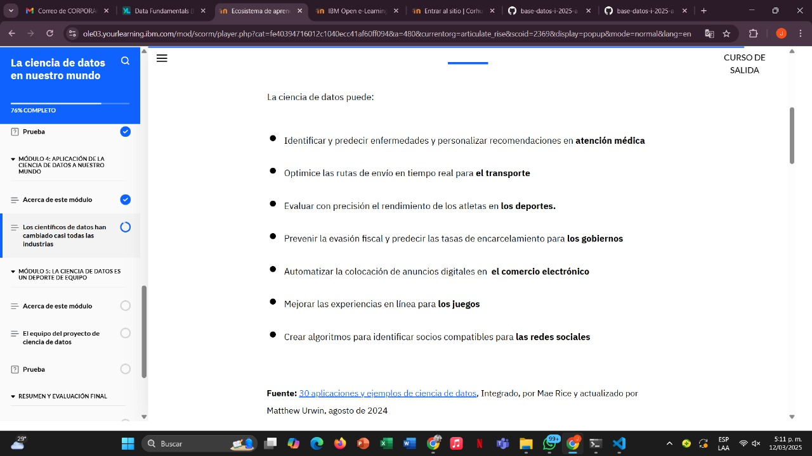
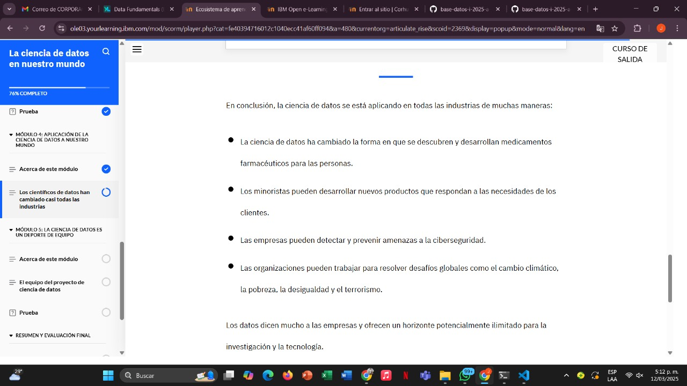

# Learning - Data Science
***

## Concepts

- En este módulo, aprenderá cómo los proyectos de ciencia de datos en nuestro mundo impactan industrias, como la atención médica, el transporte, los deportes, el comercio electrónico y las plataformas sociales

# Objetivos de aprendizaje

1. Reconocer industrias y aplicaciones de la ciencia de datos en nuestro mundo para resolver problemas y ayudar a descubrir innovaciones.

## Los científicos de datos han cambiado casi todas las industrias

- La ciencia de datos ha revolucionado la forma en que se perciben los datos. Existen numerosas aplicaciones de la ciencia de datos en la salud, la banca, el comercio electrónico, la manufactura y más. Empresas de big data como Amazon, Google y Facebook utilizan conceptos de la ciencia de datos para obtener información y tomar decisiones empresariales para sus organizaciones.

## Conclusion

