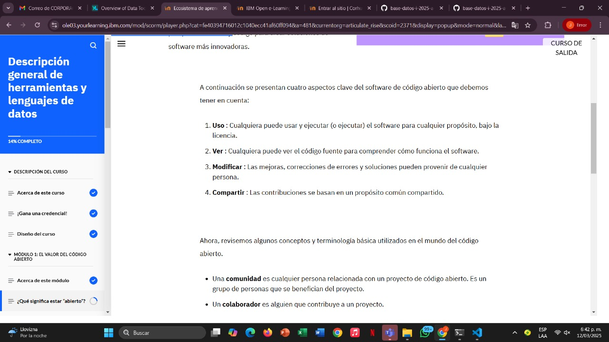
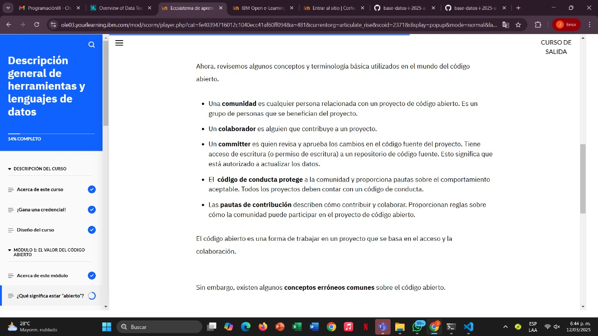
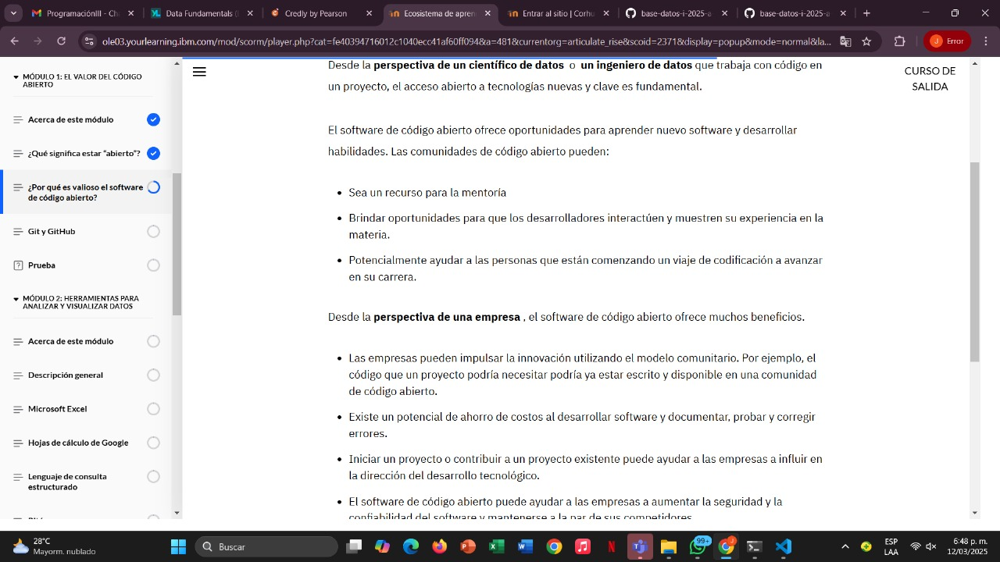
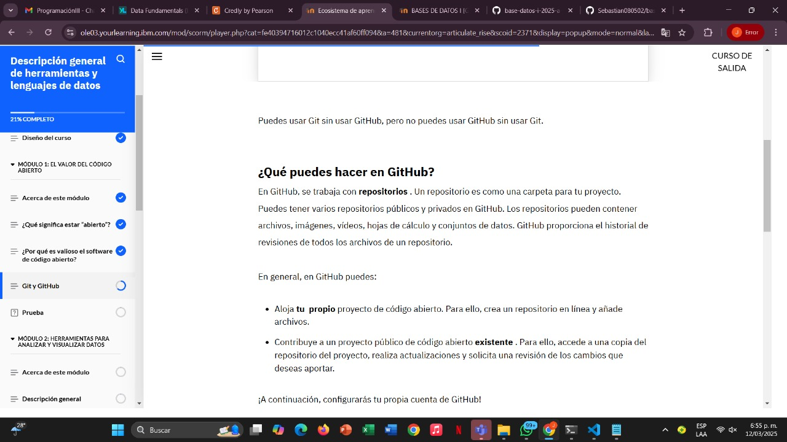
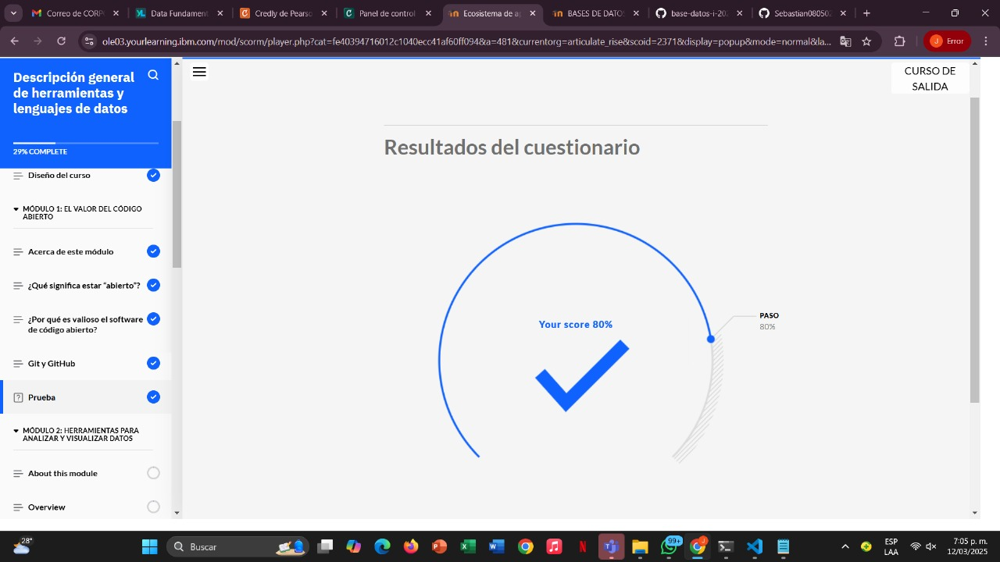

# Learning - Data Science
***

## Concepts

- En este módulo, aprenderá sobre la forma colaborativa de trabajar con software de código abierto y tendrá la oportunidad de configurar una cuenta de GitHub para practicar la adición de datos.

# Objetivos de aprendizaje

1. Reconocer el valor de colaborar y utilizar código abierto en el campo de la ciencia de datos.
2. Identificar el propósito de GitHub

## ¿Que significa estar abierto?

- El software de código abierto es un software con código que se publica públicamente y puede ser utilizado por cualquier persona.

El software de código abierto es colaborativo, lo que significa que se basa en una comunidad virtual de personas que revisan, modifican y comparten el código fuente. Los desarrolladores comparten perspectivas, ideas y código para crear soluciones de software más innovadoras.

## ¿Por qué es valioso el software de código abierto?

## Git y GitHub

## Finalizacion del modulo 1

