# Learning - Overview of Data Tools and Languages
***

## Concepts

- En este módulo, aprenderá sobre una selección de herramientas de análisis y visualización de datos para familiarizarse con las que utilizan los profesionales en sus proyectos. Descubrirá el propósito de cada herramienta, revisará un ejemplo y tendrá la oportunidad de explorar los recursos en línea sugeridos para obtener más información.

# Objetivos de aprendizaje

1. Identificar el propósito de una selección de herramientas comunes para analizar y visualizar datos, incluyendo:
* Microsoft Excel
* Hojas de cálculo de Google
* Lenguaje de consulta estructurado (SQL)
* Pitón
* Estudio IBM Watson
* Cuadro
* Matplotlib

# Microsoft Excel

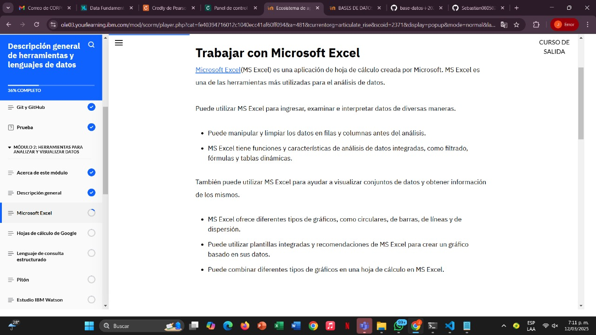

## Grafica

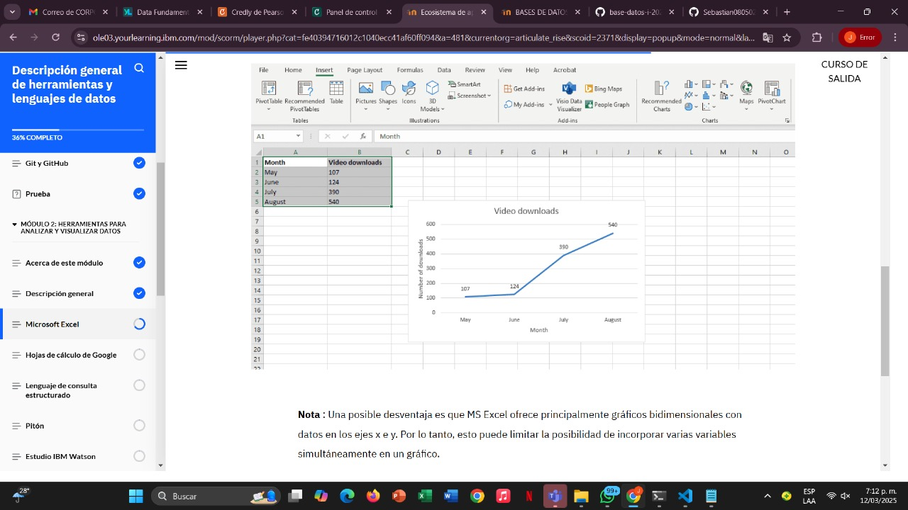

## Hojas de calculo de Google
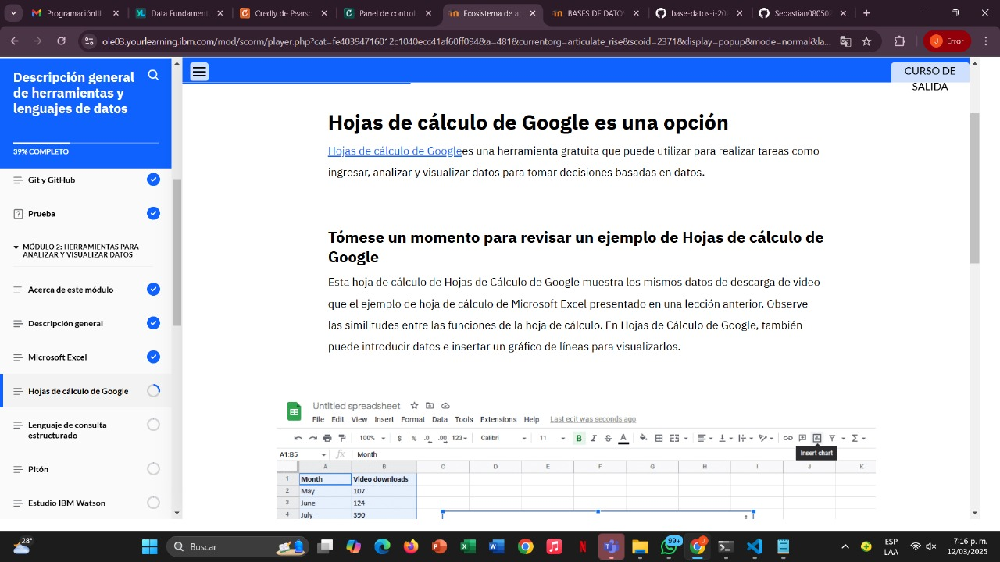

## Grafica

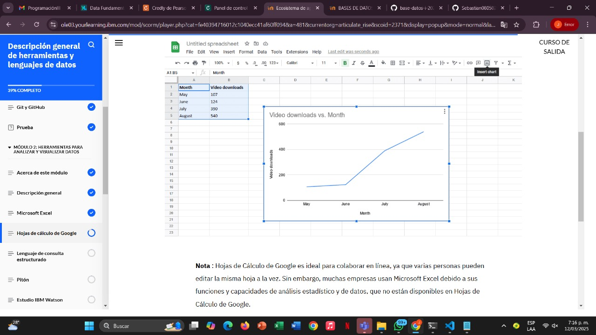

## Lenguaje de consulta estructurado

1. SQL (Structured Query Language) es un lenguaje de consulta estructurado para bases de datos

## ¿Que es SQL?

* El lenguaje de consulta estructurado (SQL) es un lenguaje estándar para la comunicación con bases de datos. Como su nombre indica, SQL se utiliza cuando se tienen datos estructurados en una base de datos relacional. SQL ha sido un estándar del Instituto Nacional Americano de Estándares (ANSI) desde 1986 y de la Organización Internacional de Normalización (ISO) desde 1987.

* SQL es un lenguaje de consulta, no un lenguaje de programación.*

## Grafica
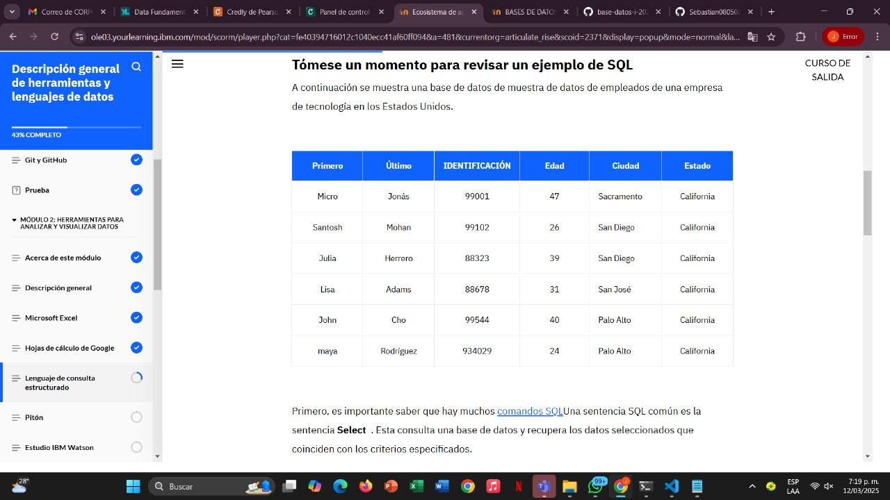

## Tabla de SQL

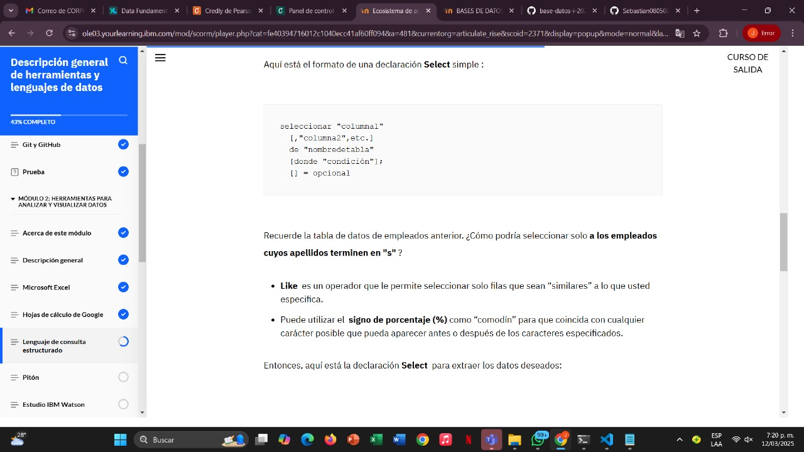

## ¿Qué es NoSQL?

* NoSQL es la abreviatura de "no solo SQL". Mientras que SQL permite trabajar con datos estructurados en bases de datos relacionales, NoSQL permite trabajar con datos no estructurados en bases de datos no relacionales. NoSQL es útil para big data y aplicaciones web en tiempo real. Por ejemplo, una empresa como Twitter, que recopila terabytes de datos de usuarios a diario, podría usar NoSQL.

- Los científicos de datos también utilizan NoSQL para comunicarse con bases de datos NoSQL.

- El propósito es almacenar y trabajar con datos no estructurados, como muchas imágenes y texto.
- Los tipos de bases de datos NoSQL incluyen bases de datos de documentos, bases de datos de columnas anchas y bases de datos de gráficos.
- En general, los profesionales de la ciencia de datos utilizan SQL para explorar, mantener y proteger los datos para poder tomar mejores decisiones.

## ¿Que es Python?

* Python Es un lenguaje de programación gratuito, de código abierto y de propósito general, disponible para todos. Python fue creado por Guido van Rossum y lanzado en 1991. Fue diseñado con la intención de ser fácil y divertido de usar. El nombre "Python" es un reconocimiento al grupo cómico británico Monty Python.

* Python se puede usar para crear aplicaciones web y respaldar proyectos de ciencia de datos. Su filosofía de diseño se centra en un código legible y caracterizado por el uso de espacios en blanco.

* Python tiene una sintaxis similar a la del inglés, con cierta influencia matemática. Por lo tanto, se anima a algunos programadores a programar sin código preparado. Otros programadores podrían descubrir que pueden escribir programas con menos líneas, en comparación con otros lenguajes de programación.

## Grafica

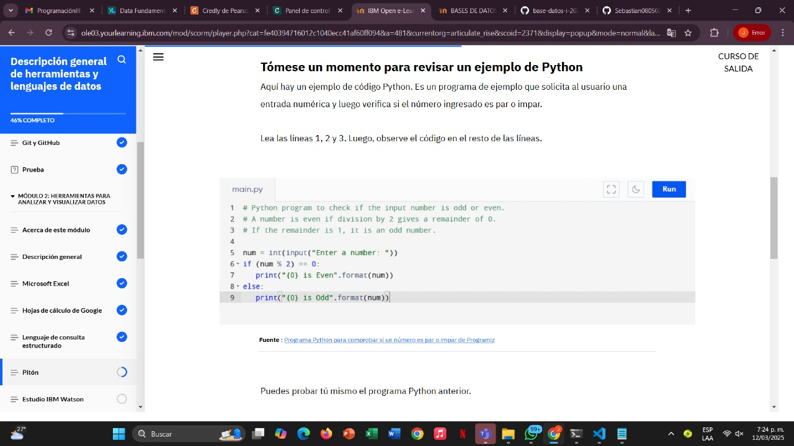

## ¿Que es Estudio IBM Watson?

IBM Watson Studio es un entorno de desarrollo integrado (IDE). Bautizado con el nombre del fundador de IBM, IBM Watson Studio reúne las herramientas de desarrollo y análisis más útiles, integrándolas en una plataforma de desarrollo lo suficientemente potente como para afrontar retos a gran escala, pero lo suficientemente sencilla como para que los desarrolladores puedan dominarla rápidamente.

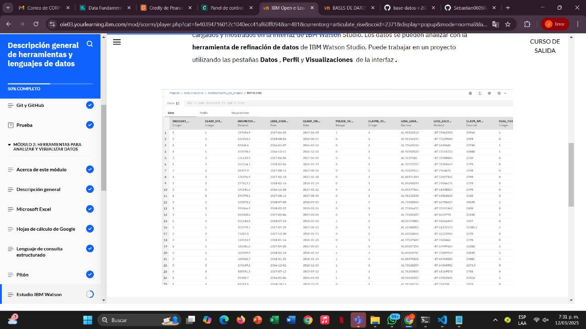

## ¿Que es Cuadro? 

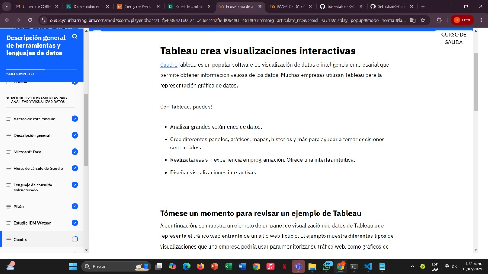

## Grafica

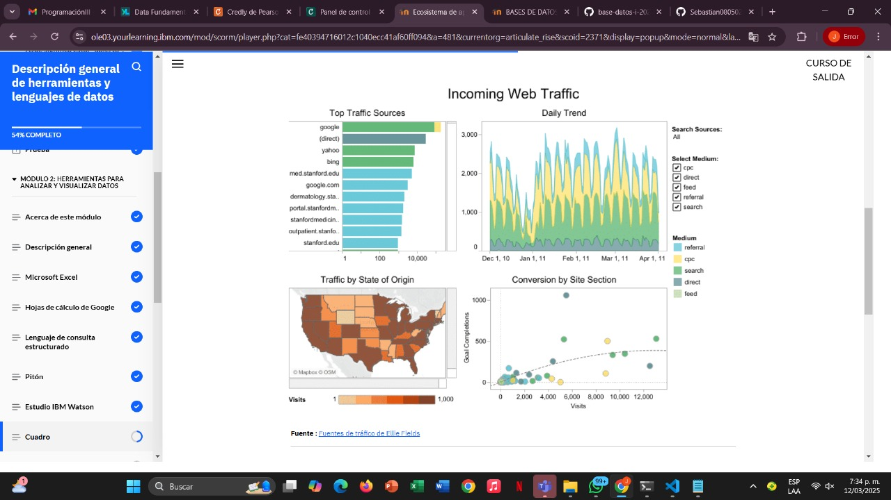

## Matplotlib es una biblioteca para gráficos en Python

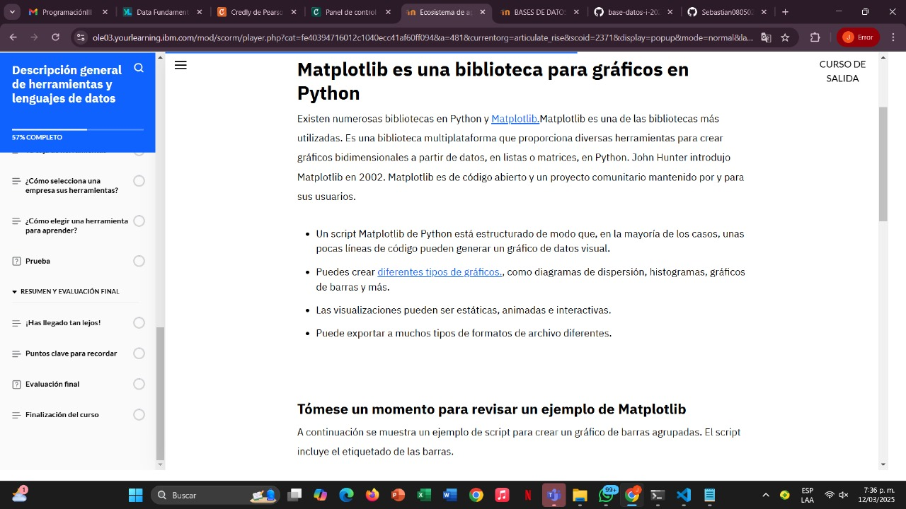

## Grafica 
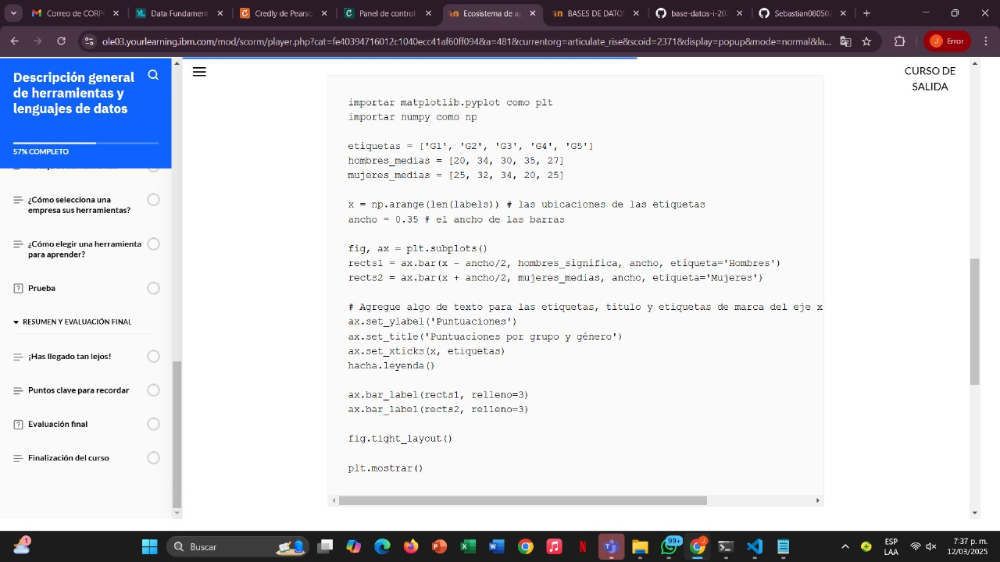

## Finalizacion modulo 2
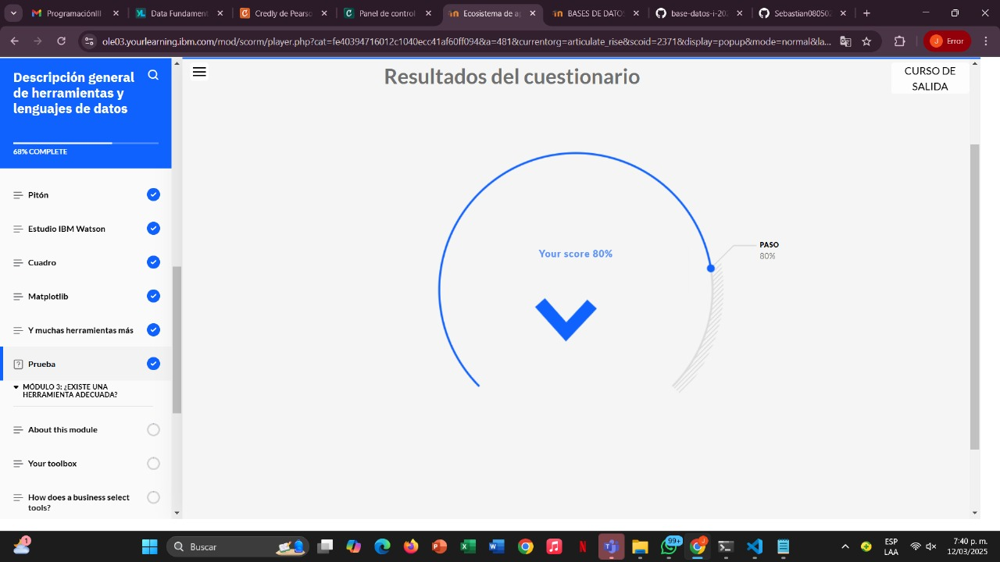

