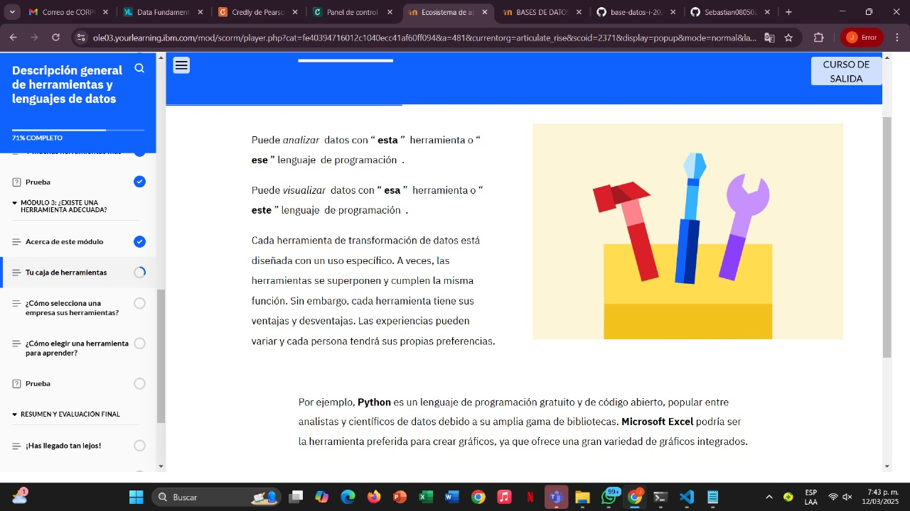
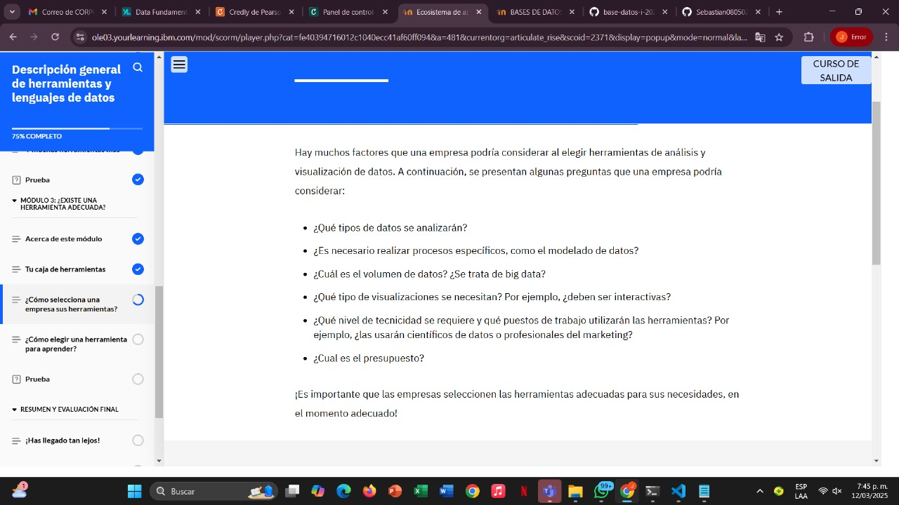
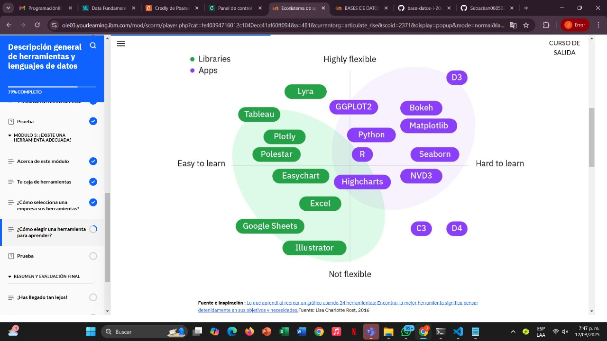
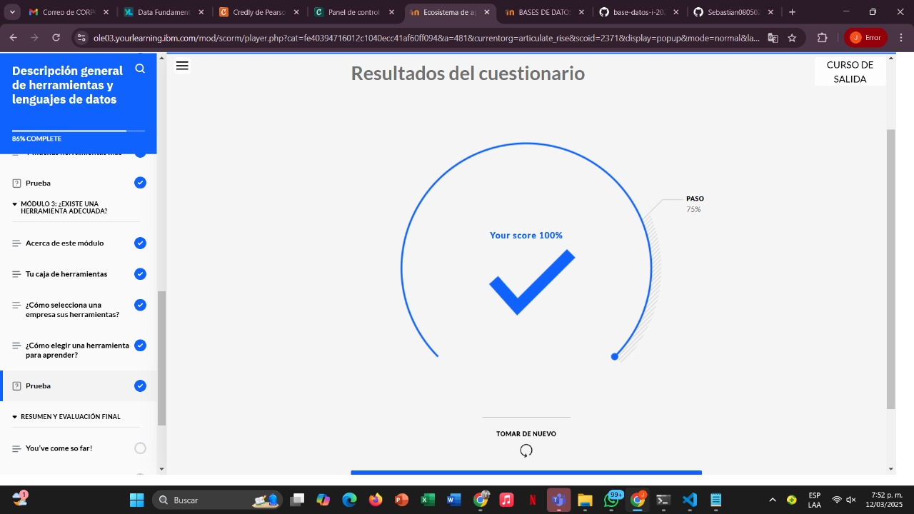
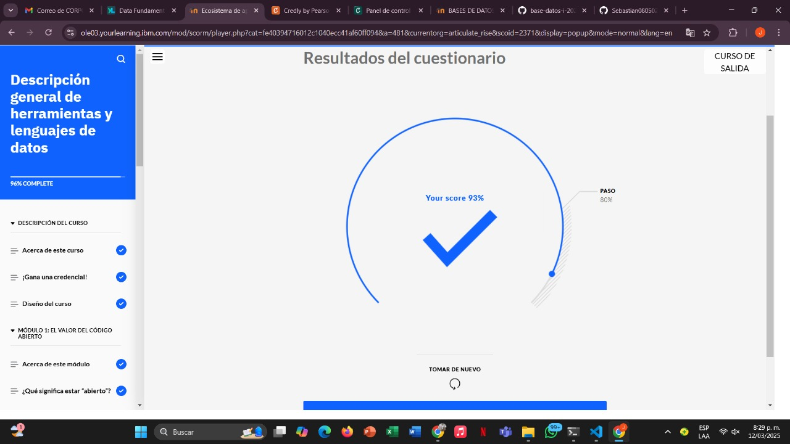

# Learning - Overview of Data Tools and Languages
***

## Concepts

- En este módulo, aprenderá qué consideran las empresas al seleccionar herramientas de datos y lenguajes de programación. Además, aprenderá qué puede considerar al elegir una herramienta de transformación de datos.  

# Objetivos de aprendizaje

1. Identificar los factores que las empresas pueden considerar al seleccionar una herramienta de transformación de datos
2. Identificar los factores que las personas pueden considerar al seleccionar una herramienta de transformación de datos

## Caja de Herrramientas

* Por ejemplo, Python es un lenguaje de programación gratuito y de código abierto, popular entre analistas y científicos de datos debido a su amplia gama de bibliotecas. Microsoft Excel podría ser la herramienta preferida para crear gráficos, ya que ofrece una gran variedad de gráficos integrados.

## ¿Como se seleccionan las herramientas?

## ¿Como elegirla?

- Existen numerosas herramientas para el análisis y la visualización de datos. Dependiendo del usuario, varían de simples a complejas y de intuitivas a difíciles de usar. No todas las herramientas son adecuadas para quienes aprenden técnicas de análisis y visualización, ni todas pueden satisfacer las necesidades de todo tipo de proyecto

## Grafica

## Finalizacion del module 3

## Finzalizacion Curso 

