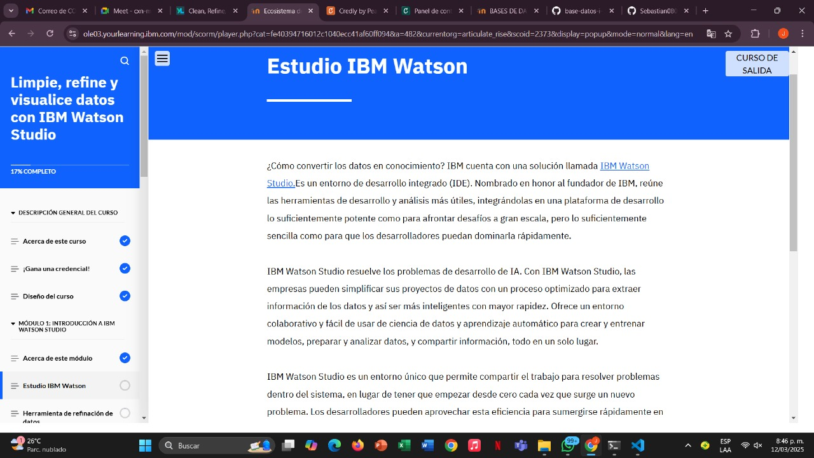
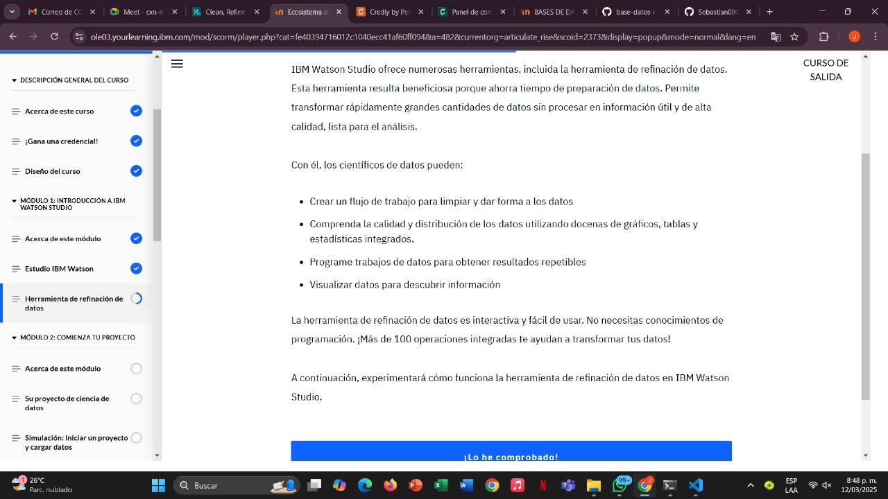

# Learning - Clean,Refine and visualize data whit IBM Watson Studio
***

## Concepts

- ¿Crees que puedes trabajar en un proyecto de ciencia de datos? ¿Puedes comprender un conjunto de datos en IBM Watson Studio? ¿Puedes extraer conclusiones de esos datos?

¡Bienvenido al curso "Limpieza, Refina y Visualiza Datos con IBM Watson Studio"  ! En este curso, practicarás la limpieza, el refinamiento y la visualización de datos mediante una serie de simulaciones, utilizando IBM Watson Studio con la herramienta de refinación de datos.

# Objetivos de aprendizaje

1. Explicar el propósito y las características clave de IBM Watson Studio
2. Configurar un nuevo proyecto en IBM Watson Studio
3. Importar un conjunto de datos
4. Limpiar datos utilizando la herramienta de refinación de datos
5. Refinar datos utilizando la herramienta de refinación de datos
6. Crear una visualización de datos
7. Extraer información de una visualización de datos

## Estudio de IBM Watson

IBM Watson Studio ofrece a los científicos de datos:

* Un proceso optimizado para proyectos de datos
* Un entorno colaborativo de ciencia de datos y aprendizaje automático
* Visualizaciones fáciles de crear
* Acceso a herramientas de código abierto
* Una forma de desarrollar, entrenar, administrar e implementar aplicaciones impulsadas por IA
* IBM Watson Studio es un entorno integral todo en uno para explorar más de lo que es posible con los datos y la inteligencia artificial (IA).

# Herramienta de refinacion de datos 

