# Learning - Clean,Refine and visualize data whit IBM Watson Studio
***

## Concepts

- En este módulo, aprenderá sobre el escenario de su proyecto de ciencia de datos. También realizará prácticas en una simulación para configurar un nuevo proyecto en IBM Watson Studio e importar datos.
# Objetivos de aprendizaje

1. Configurar un nuevo proyecto en IBM Watson Studio
2. Importar un conjunto de datos

## Proyecto de ciencia datos

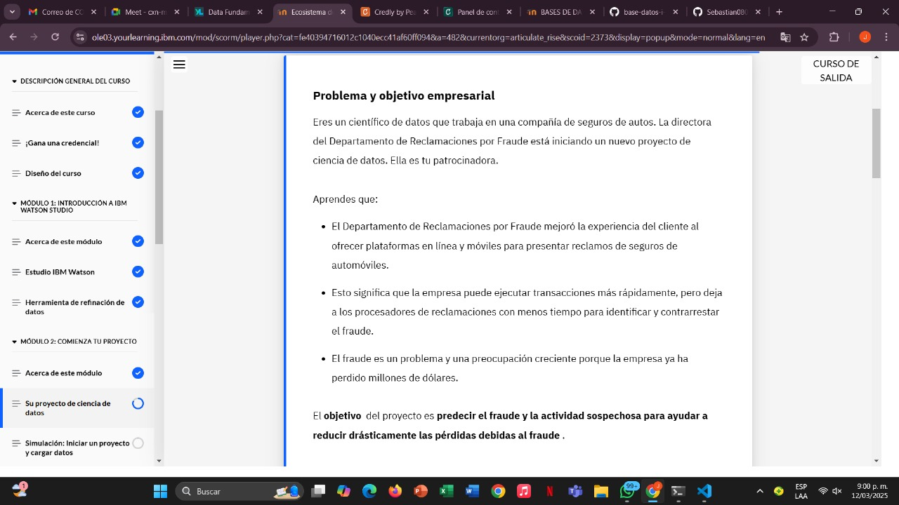

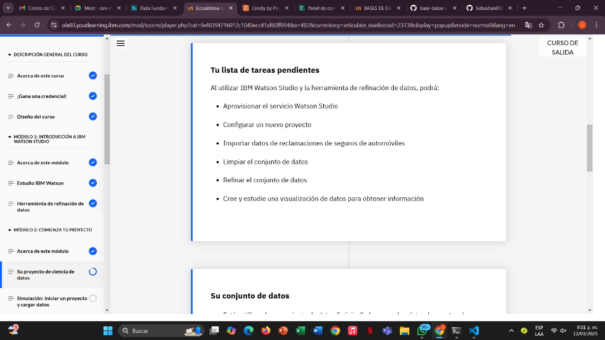

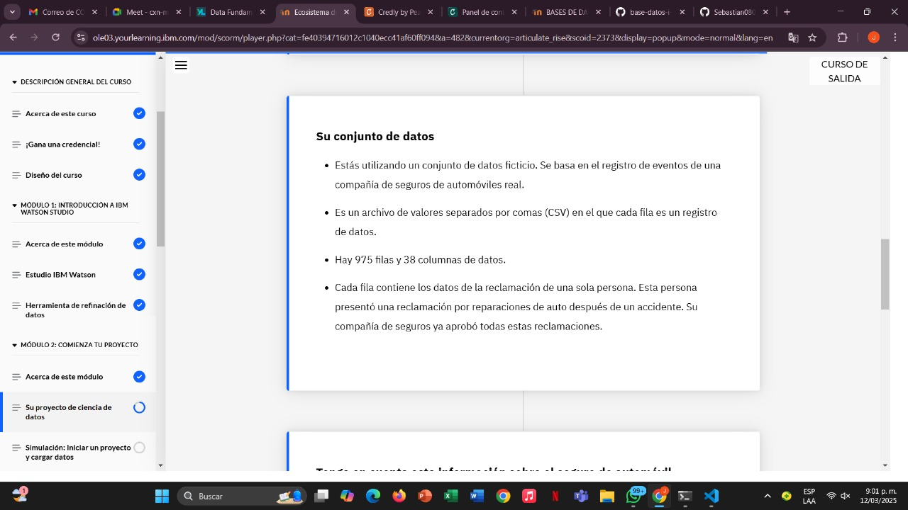

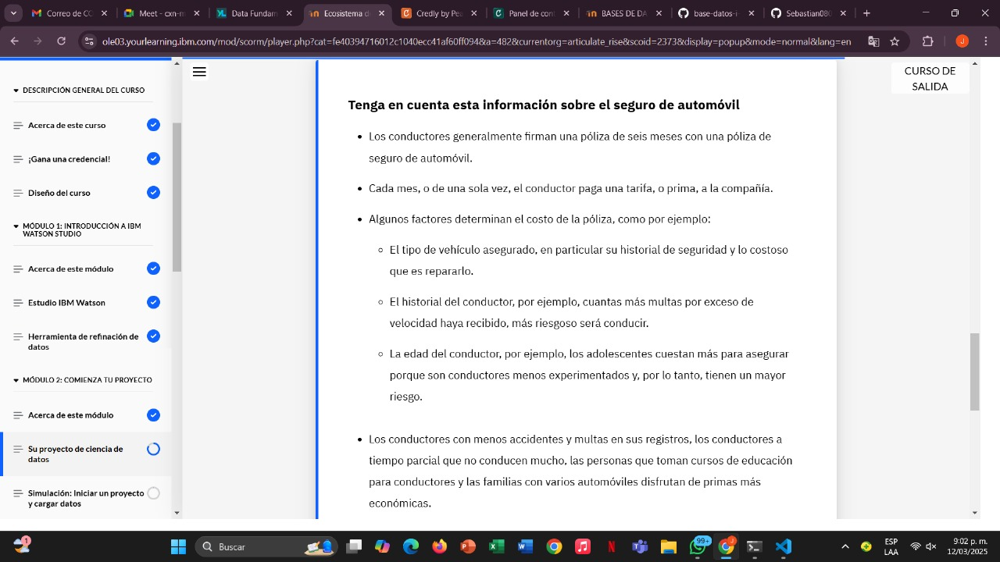

## Simulacion proyecto

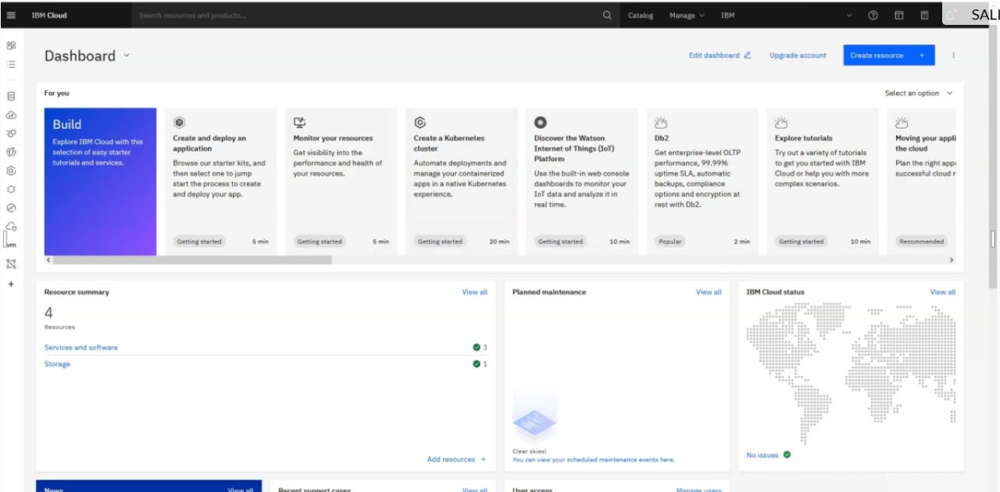
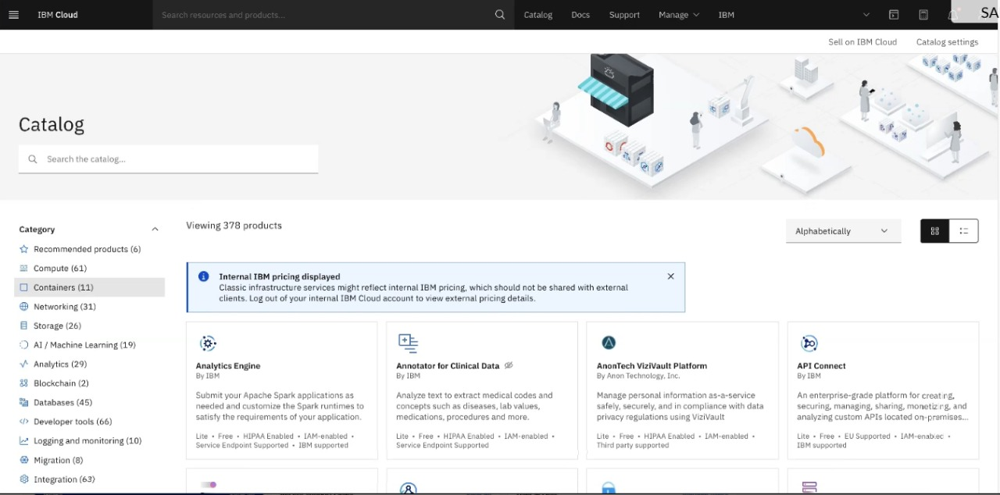
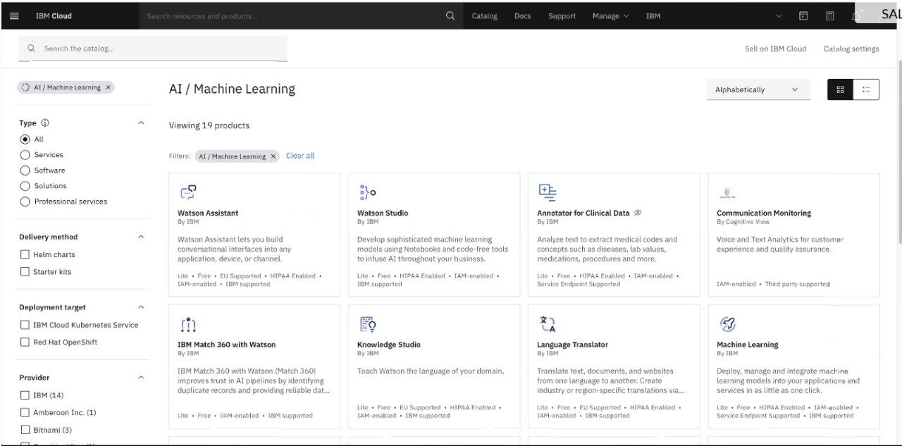
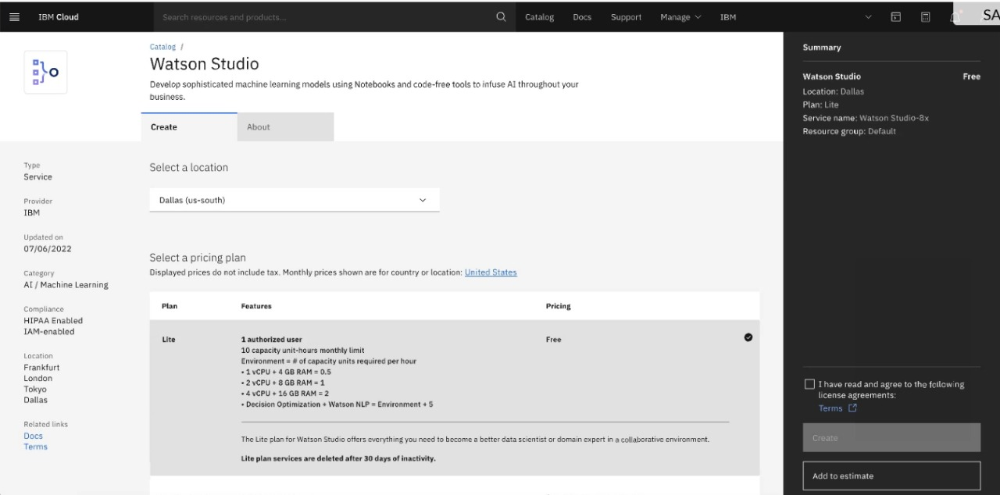
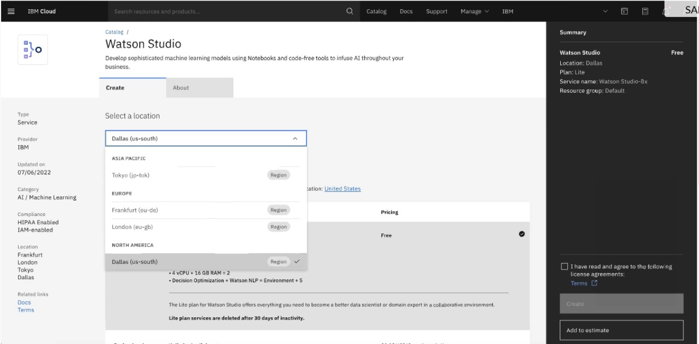
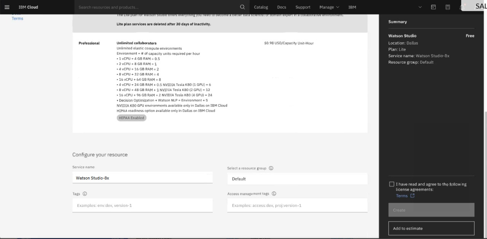
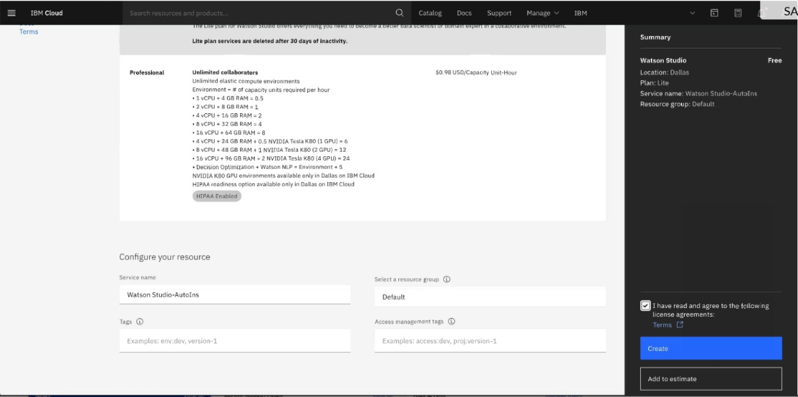
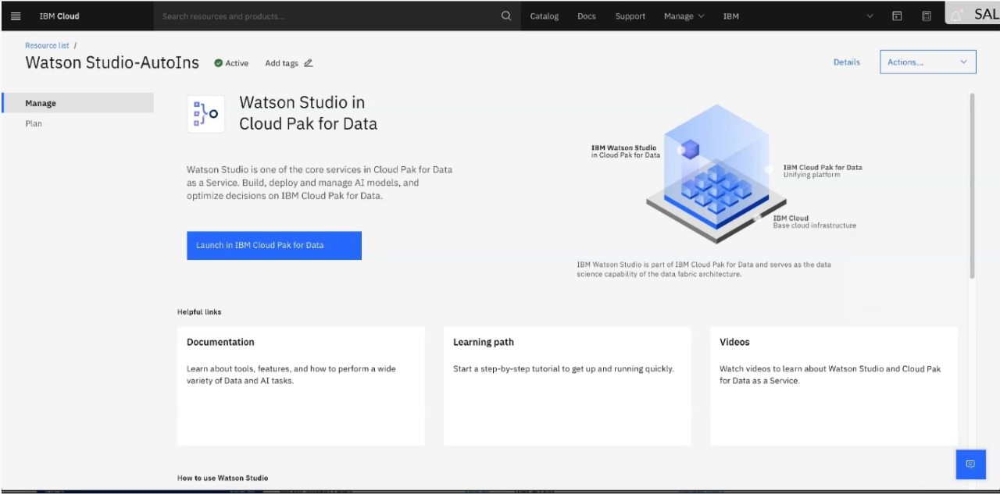
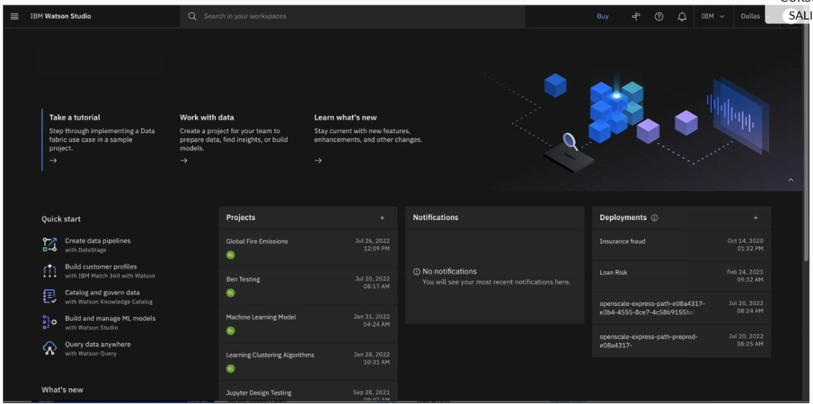
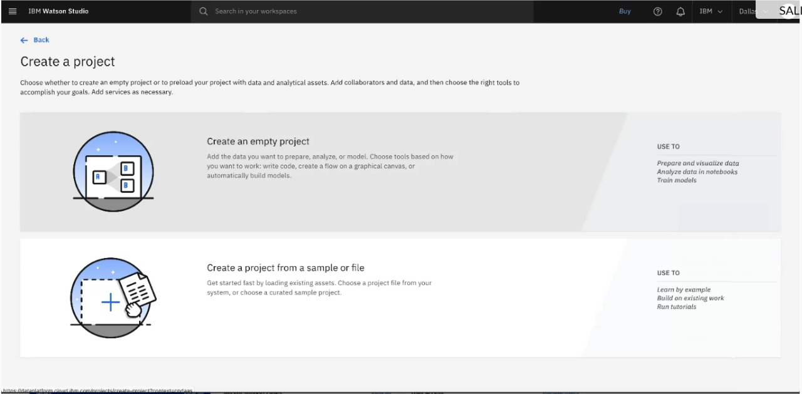
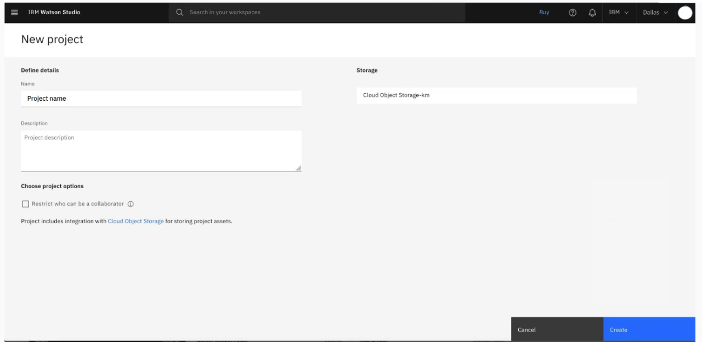
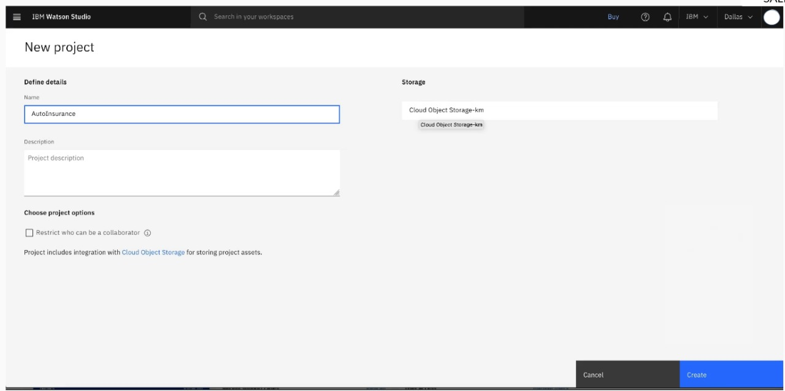
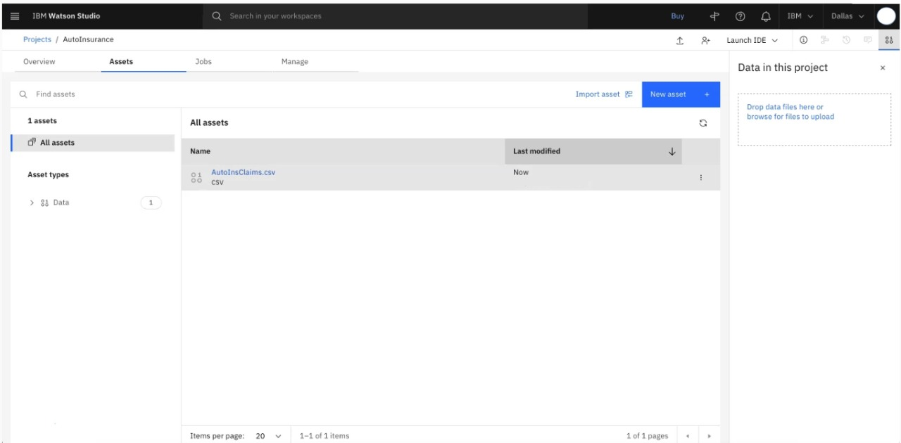
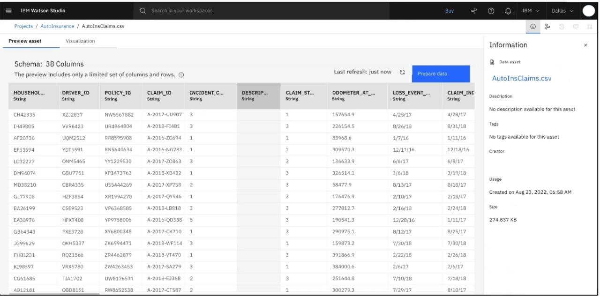

## Finalizacicon modulo 2

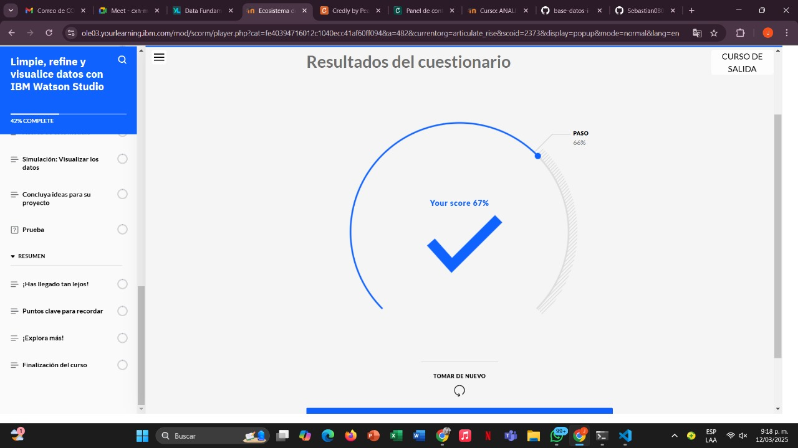

