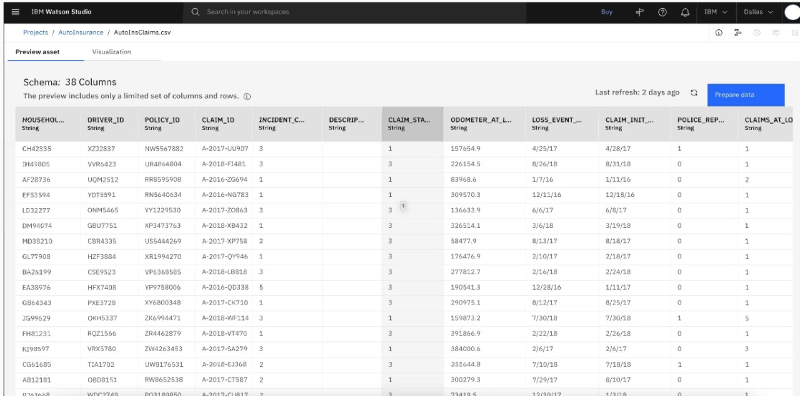
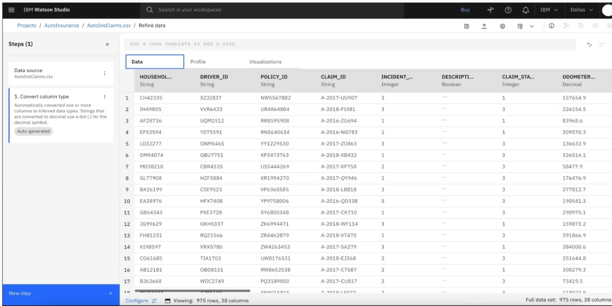
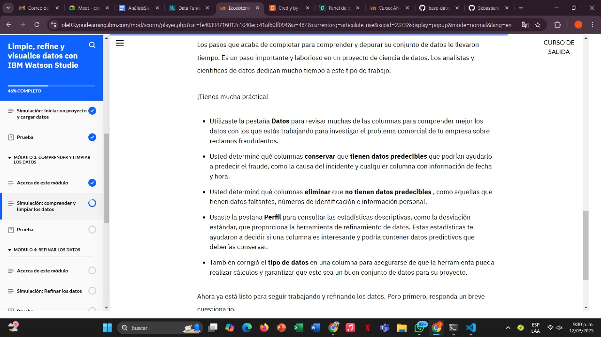
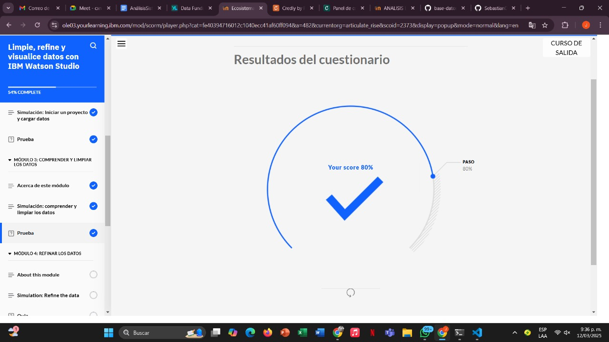

# Learning - Clean,Refine and visualize data whit IBM Watson Studio
***

## Concepts

- En este módulo, obtendrá práctica en una simulación para comprender y limpiar datos en IBM Watson Studio con la herramienta de refinación de datos.
# Objetivos de aprendizaje

1. Limpiar datos utilizando la herramienta de refinación de datos

## Simulacion

# Informacion adicional

## Finalizacion Modulo 3

