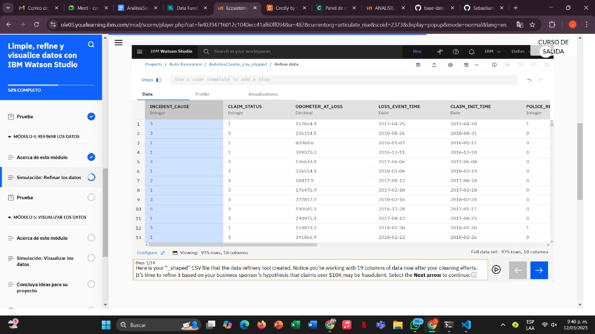
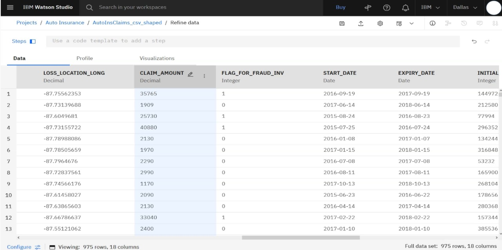
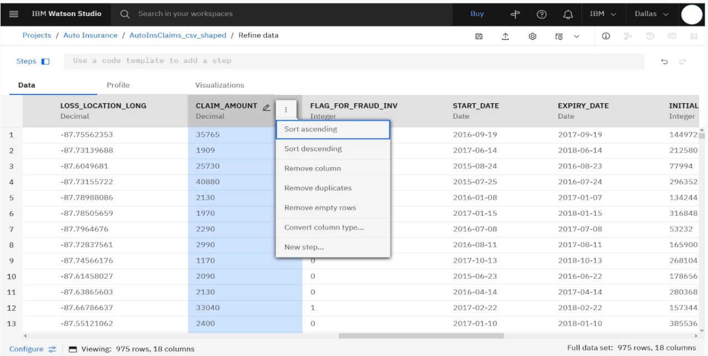
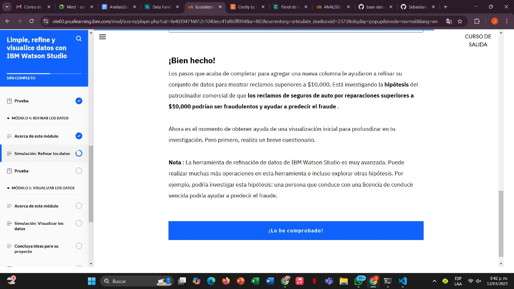
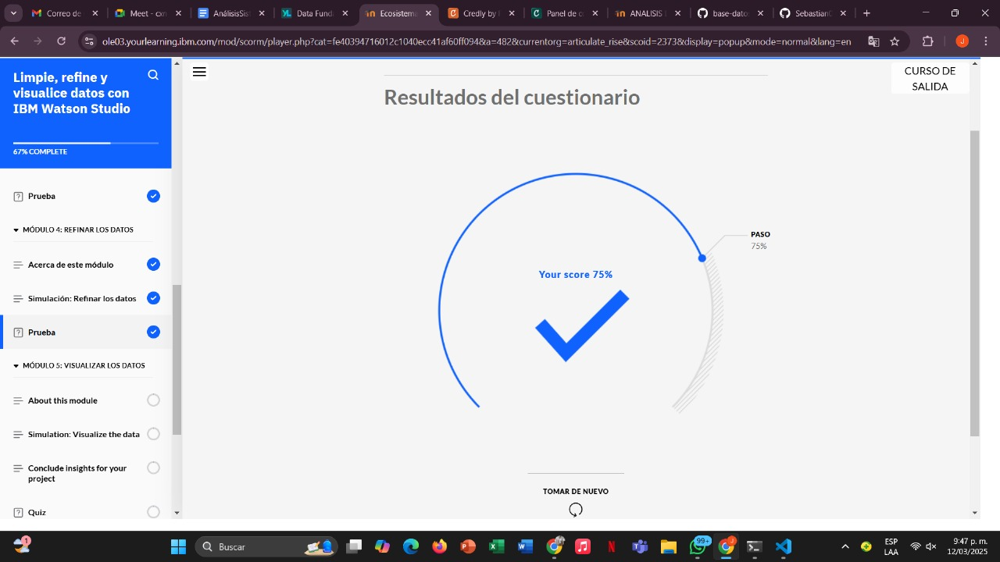

# Learning - Clean,Refine and visualize data whit IBM Watson Studio
***

## Concepts

- En este módulo, obtendrá práctica en una simulación para refinar datos en IBM Watson Studio con la herramienta de refinación de datos.

# Objetivos de aprendizaje

1. Refinar datos utilizando la herramienta de refinación de datos

# Simulacion: refinar los datos

## Informacion adicional

## Finalizacion modulo 4 

