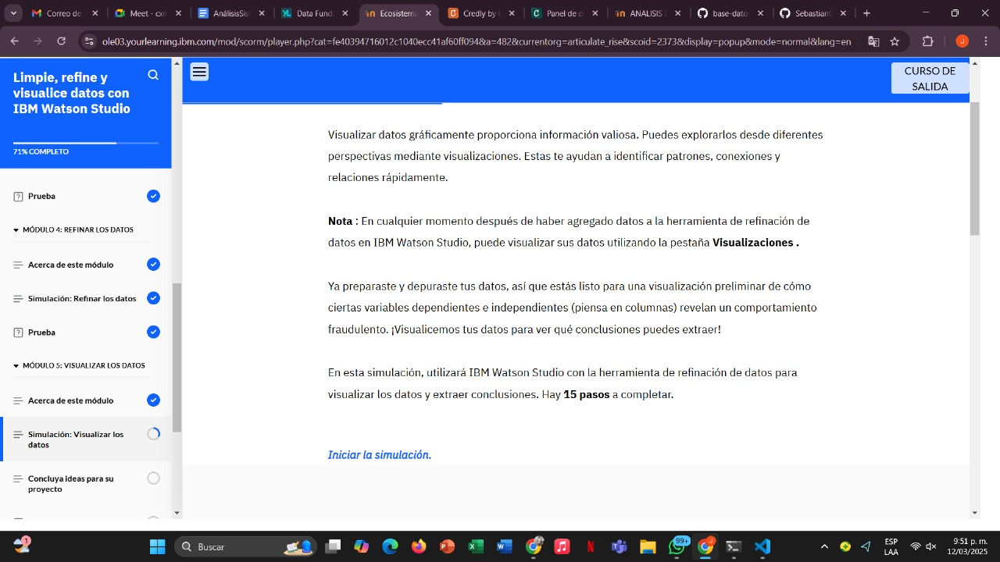
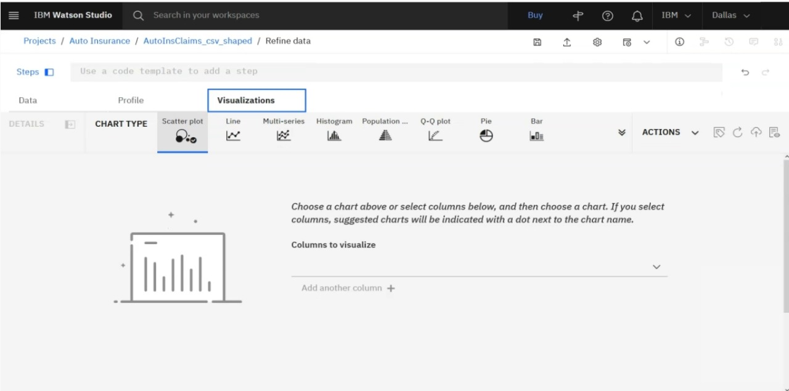
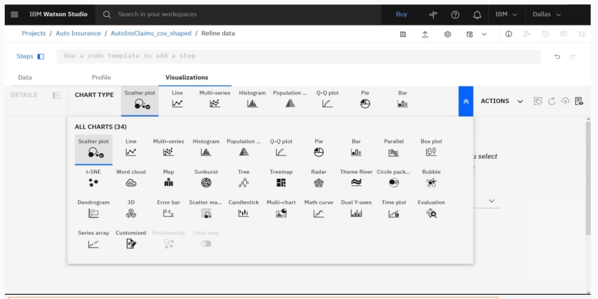
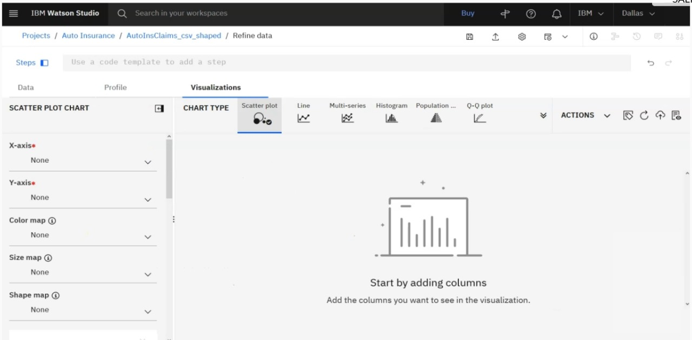
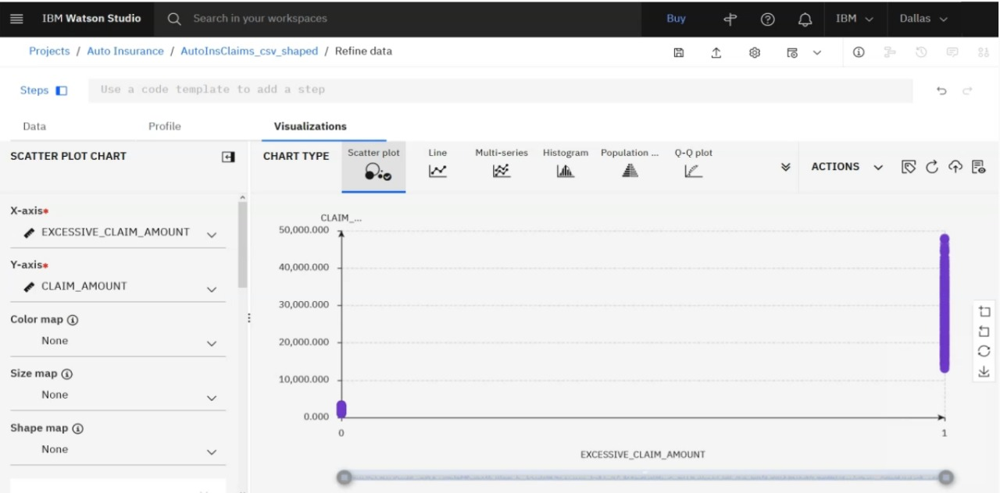
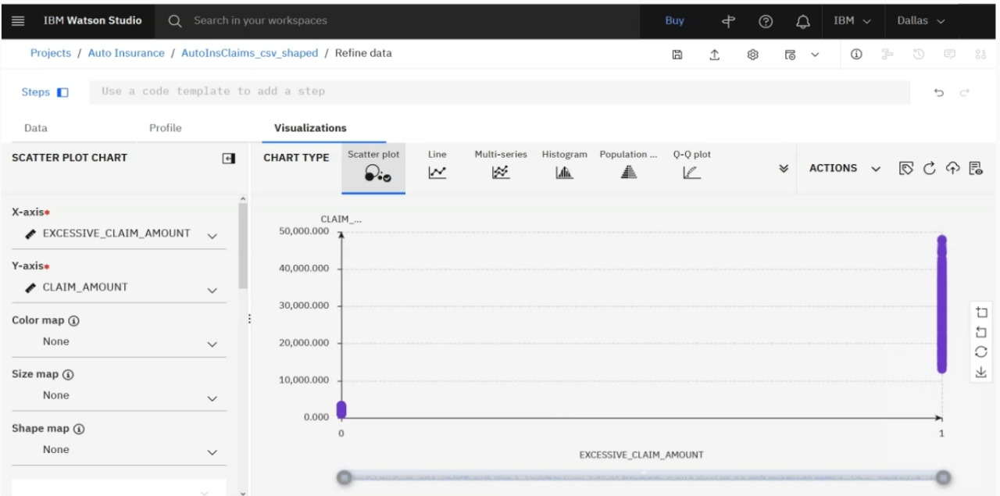
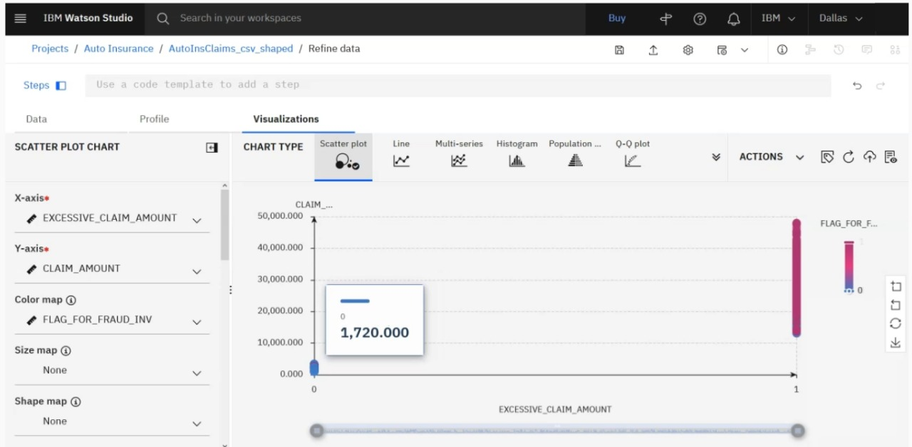
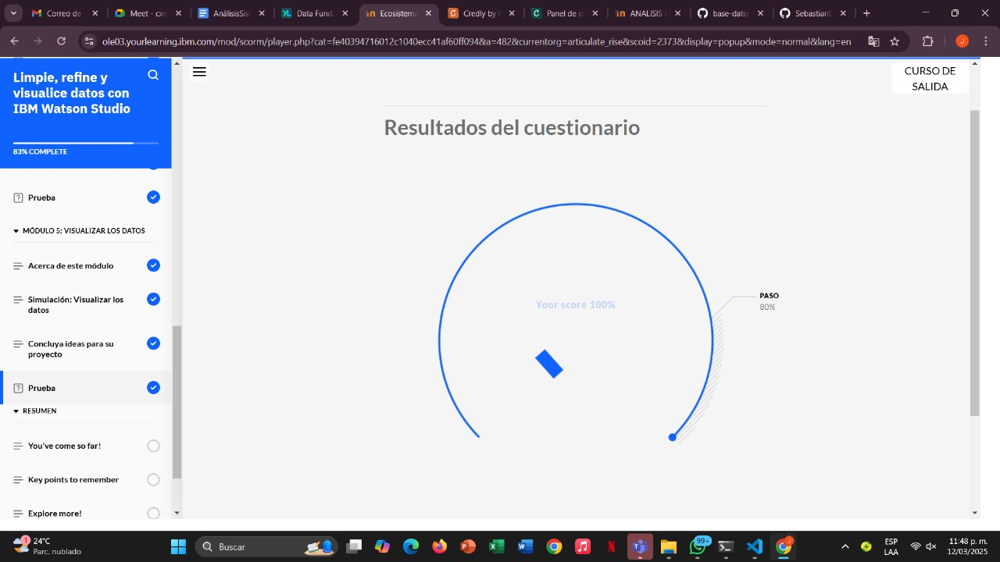

# Learning - Clean,Refine and visualize data whit IBM Watson Studio
***

## Concepts

- En este módulo, obtendrá práctica en una simulación para visualizar datos en IBM Watson Studio con la herramienta de refinación de datos

# Objetivos de aprendizaje

1. Crear una visualización de datos
2. Extraer información de una visualización de datos

## Simualizacion: Visualizacion DATA

## Simulacion 

## Finalizacion
