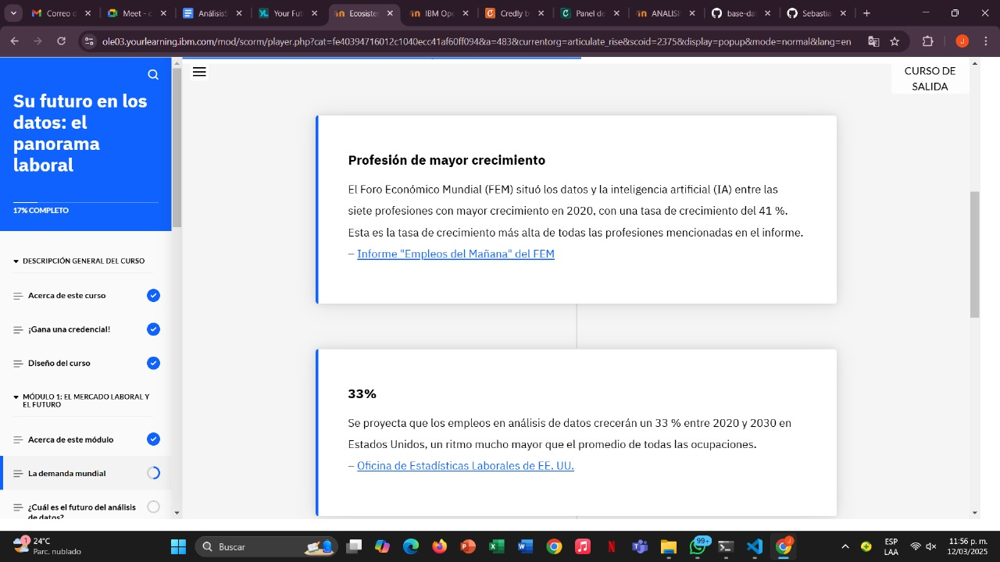
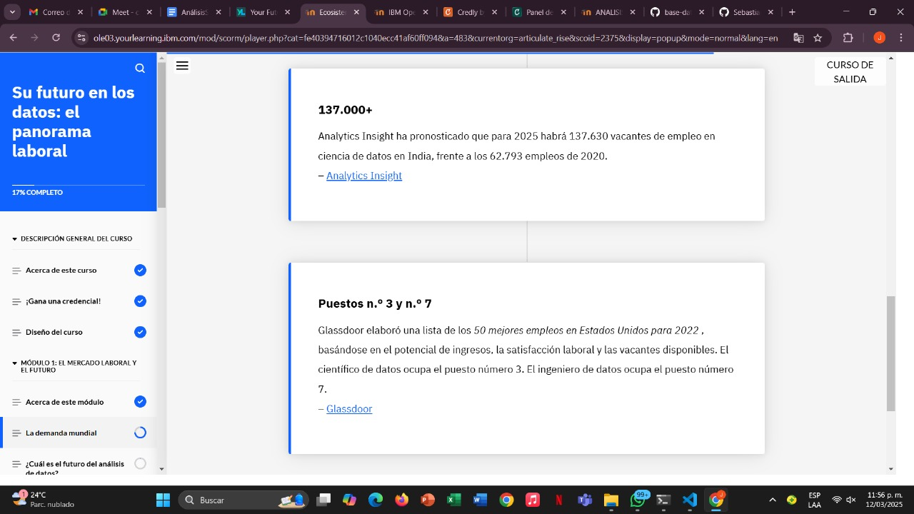

# Learning - Your Future in Data The Job Landscape
***

## Concepts

- Las empresas reconocen el valor de una estrategia empresarial basada en datos y la importancia del análisis de datos como parte de dicha estrategia. Por ello, hoy en día existe una gran demanda de tomadores de decisiones basados ​​en datos. Las empresas necesitan profesionales cualificados y talentosos que aporten información valiosa al flujo continuo de datos que recopilan. Se prevé que la demanda de analistas y científicos de datos aumente a medida que el mundo se digitaliza.

¡Bienvenido al curso "Tu Futuro en Datos: El Panorama Laboral" ! En este curso, aprenderás sobre el mercado laboral de datos y sus proyecciones, las responsabilidades y habilidades de un analista y científico de datos, y recursos y oportunidades de aprendizaje para que puedas explorar más.

# Objetivos de aprendizaje

1. Reconocer la demanda global de analistas de datos y científicos de datos en el mercado laboral
2. Reconocer el futuro del campo del análisis de datos
3. Identificar las industrias en las que trabajan los profesionales de datos
4. Identificar las principales responsabilidades de un analista de datos y un científico de datos.
5. Identificar las habilidades que necesitan los profesionales de datos
6. Identificar las herramientas que hay que conocer al iniciarse en el campo
7. Identificar recursos para aprender más y mantenerse actualizado en el campo de la ciencia de datos.

## El mercado laboral y el futuro

## ¿Cuál es el futuro del análisis de datos?