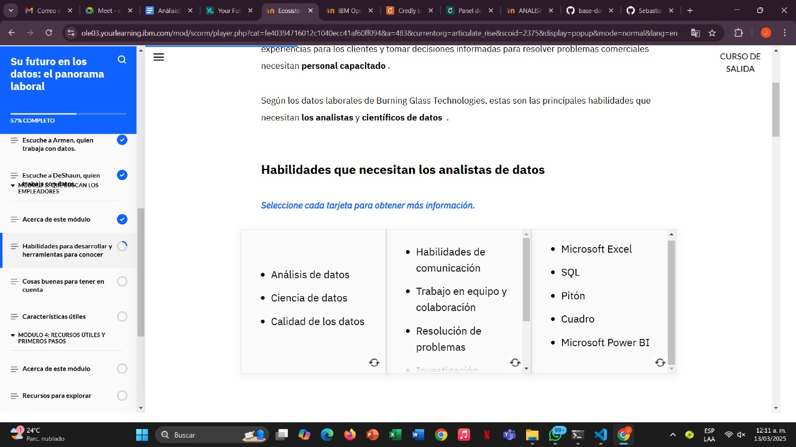
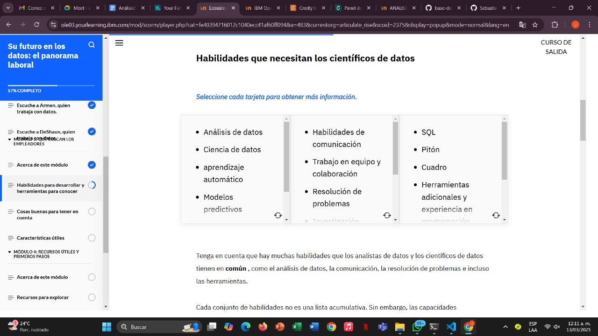
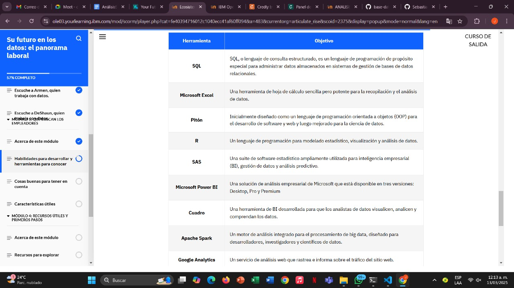
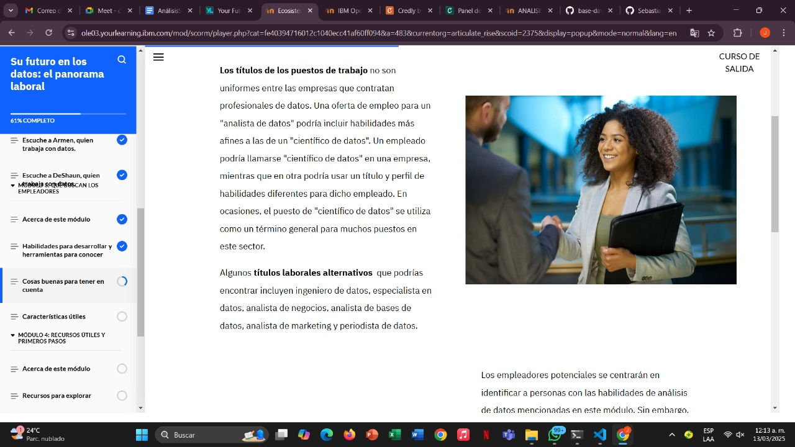
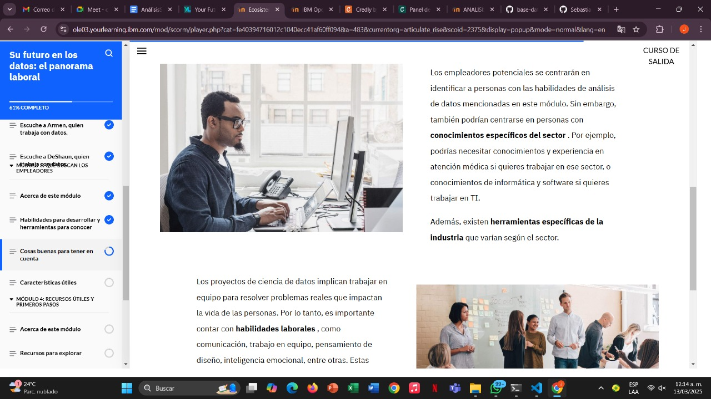
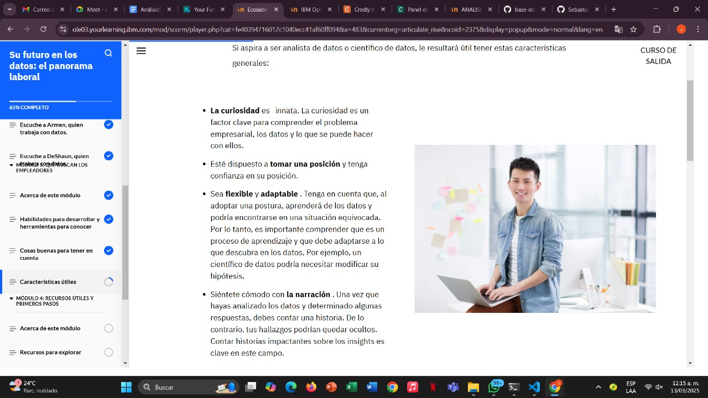

# Learning - Your Future in Data The Job Landscape
***

## Concepts

- En este módulo, aprenderá en qué se centran los empleadores potenciales al contratar analistas y científicos de datos. 

# Objetivos de aprendizaje

1. Identificar las habilidades que necesitan los profesionales de datos
2. Identificar las herramientas que hay que conocer al iniciarse en el campo

## Habilidades para desarrollar y herramientas para conocer

## Cientifico de datos

## Herramientas y analisis de datos populares

## Cosas para tener en cuenta

## Características útiles

## Piensa en ti mismo

* ¿Eres una persona con pensamiento crítico y buena comunicación que busca resolver problemas utilizando datos? ¿Te gusta investigar a fondo y aprender sobre la marcha? Si respondiste afirmativamente a estas preguntas, quizás una carrera en análisis o ciencia de datos sea ideal para ti. Te conviene considerar tus habilidades actuales, tus intereses personales y las habilidades que puedes desarrollar .

## Finalizacion del modulo 3
***
