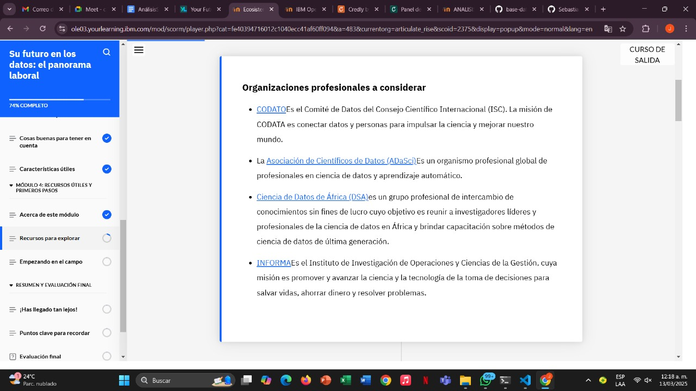
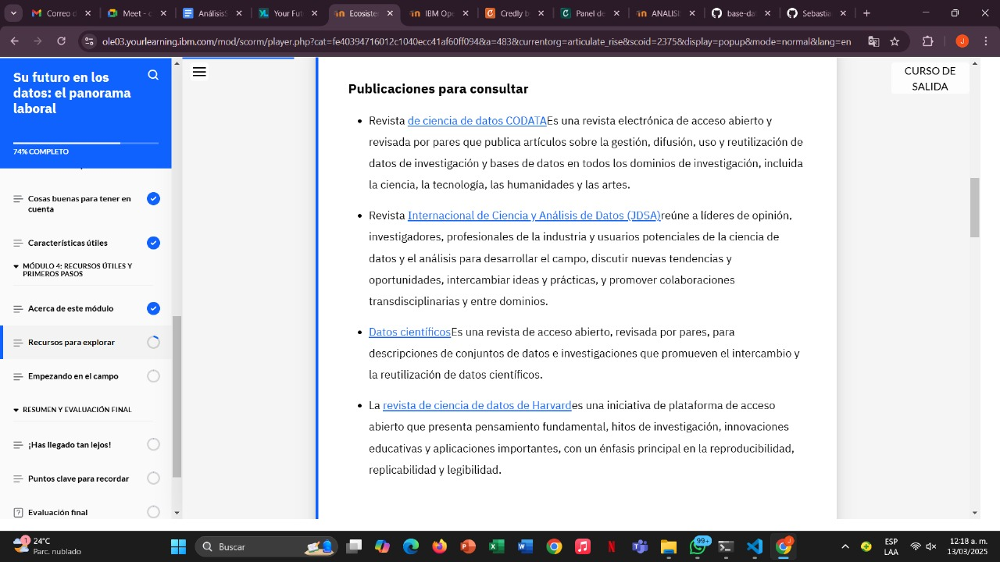
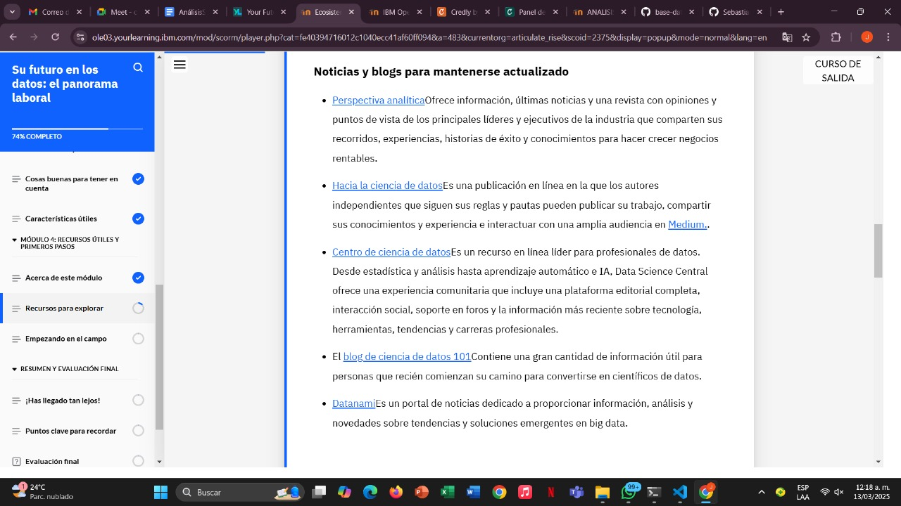
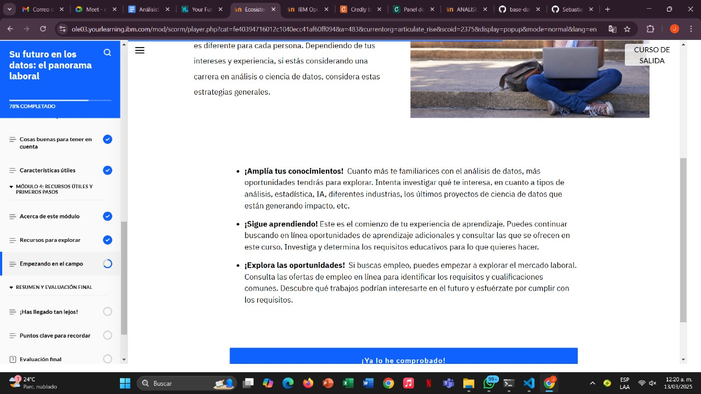
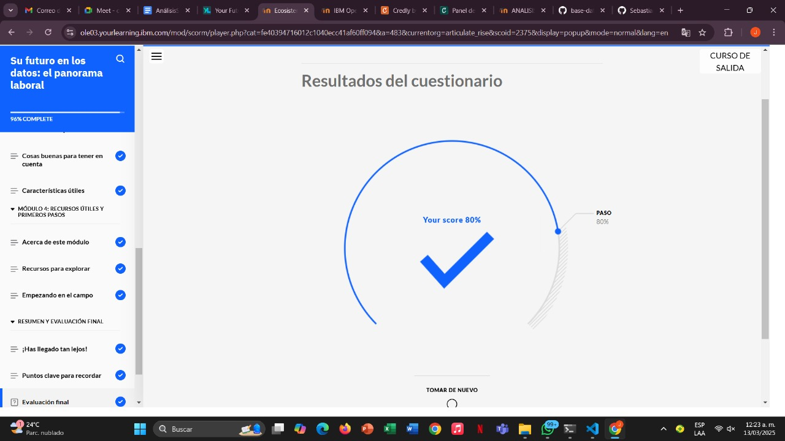

# Learning - Your Future in Data The Job Landscape
***

## Concepts

- En este módulo, aprenderá sobre los recursos que puede utilizar para explorar más sobre los datos y mantenerse actualizado con los últimos desarrollos.

# Objetivos de aprendizaje

1. Identificar recursos para aprender más y mantenerse actualizado en el campo de la ciencia de datos.

## Recursos para explorar

- Esta lección tiene como objetivo brindarle inspiración para futuras exploraciones.

Aquí tienes algunos recursos que puedes explorar, guardar en tus favoritos y tener en cuenta si quieres profundizar en los datos y mantenerte al día con los últimos avances en este campo. Esta lista es una selección exhaustiva. Hay muchas organizaciones y sitios web para explorar, según tus intereses.

## Empezando en el Campo

 # ¿Qué sigue? ¿Qué puedes hacer para iniciarte en el campo de los datos?

- El camino para convertirse en un profesional de datos es diferente para cada persona. Dependiendo de tus intereses y experiencia, si estás considerando una carrera en análisis o ciencia de datos, considera estas estrategias generales.

## Finalizacion modulo 4

